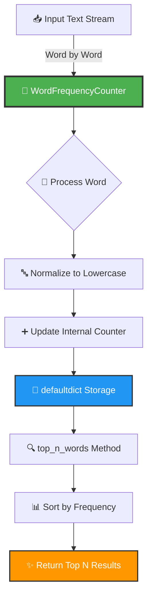

<div align="center">

# 📊 Word Frequency Counter


</div>

---

## 🎯 Problem Statement

<details open>
<summary><b>Click to expand</b></summary>

> Design an object-oriented solution that processes a **stream of words** and maintains a **real-time count** of the most frequently occurring words. The system must support configurable top-N retrieval and efficient word-by-word updates.

</details>

---

## 🏗️ Architecture

<div align="center">



</div>

---

## 💡 Solution Overview

<table>
<tr>
<td width="50%">

### ✨ Key Features

- 🎯 **Encapsulation**: Internal word counts managed within the class
- ⚙️ **Configurability**: Customizable `n` parameter (default: 10)
- ⚡ **Efficiency**: O(1) word insertion, O(n log n) retrieval
- 📈 **Scalability**: Can process unlimited word streams

</td>
<td width="50%">

### 🧩 Key Components

| Component | Purpose | Time |
|-----------|---------|------|
| `__init__` | Initialize counter | O(1) |
| `process_word` | Count words | O(1) |
| `top_n_words` | Retrieve top N | O(n log n) |

</td>
</tr>
</table>

---

## 🔄 Data Flow Visualization

<div align="center">

```
📖 Stream: ["the", "quick", "brown", "fox", "the", "fox"]
         ↓
    🔵 process_word("the")   → {"the": 1}
         ↓
    🔵 process_word("quick") → {"the": 1, "quick": 1}
         ↓
    🔵 process_word("brown") → {"the": 1, "quick": 1, "brown": 1}
         ↓
    🔵 process_word("fox")   → {"the": 1, "quick": 1, "brown": 1, "fox": 1}
         ↓
    🔵 process_word("the")   → {"the": 2, "quick": 1, "brown": 1, "fox": 1}
         ↓
    🔵 process_word("fox")   → {"the": 2, "quick": 1, "brown": 1, "fox": 2}
         ↓
    ✅ top_n_words(2)        → [("the", 2), ("fox", 2)]
```

</div>

---

## 🚀 Quick Start

<details>
<summary><b>📋 Prerequisites</b></summary>

```bash
Python 3.8 or higher
```

</details>

<details>
<summary><b>▶️ Run the Project</b></summary>

```bash
cd project-1
python script.py
```

</details>

<details>
<summary><b>📤 Expected Output</b></summary>

```python
[('the', 3), ('fox', 2), ('quick', 2), ('brown', 1), ('jumps', 1),
 ('over', 1), ('lazy', 1), ('dog', 1), ('was', 1)]
```

</details>

---

## 💻 Usage Example

```python
from script import WordFrequencyCounter

# 🎯 Initialize with top-5 configuration
counter = WordFrequencyCounter(n=5)

# 📝 Process words from any source
text = "hello world hello python world world"
for word in text.split():
    counter.process_word(word)

# 🏆 Get top 5 most frequent words
results = counter.top_n_words()
print(results)  # [('world', 3), ('hello', 2), ('python', 1)]
```

<div align="center">

</div>

---

## 🔧 Technical Deep Dive

### 🤔 Why `defaultdict`?

<table>
<tr>
<td>

✅ **Automatic initialization** - No need to check if key exists

</td>
<td>

✅ **Cleaner code** - Eliminates boilerplate logic

</td>
<td>

✅ **Performance** - Constant-time operations

</td>
</tr>
</table>

### ⏱️ Algorithm Complexity

```
Space Complexity:  O(m) where m = unique words

Time Complexity:
  ├─ process_word():   O(1) average case
  └─ top_n_words():    O(m log m) for sorting
```

### 🎨 Design Principles Applied

<div align="center">

| Principle | Description |
|:---------:|:------------|
| ✅ **Single Responsibility** | Class handles only word frequency counting |
| ✅ **Encapsulation** | Internal state hidden from external access |
| ✅ **Configurability** | Flexible n parameter |
| ✅ **Extensibility** | Easy to add filtering or stemming |

</div>

---

## 🎓 Key Learnings

<table>
<tr>
<td align="center" width="25%">

### 🏛️ OOP Benefits
State management and method organization

</td>
<td align="center" width="25%">

### 📦 Data Structures
`defaultdict` for efficient counting

</td>
<td align="center" width="25%">

### 🔀 Sorting
Lambda functions for custom sort keys

</td>
<td align="center" width="25%">

### 📝 Type Hints
Better code documentation

</td>
</tr>
</table>

---

## 📊 Performance Characteristics

<div align="center">

| Operation | Best Case | Average Case | Worst Case |
|:---------:|:---------:|:------------:|:----------:|
| **Insert** | O(1) | O(1) | O(1) |
| **Retrieve Top-N** | O(n log n) | O(n log n) | O(n log n) |
| **Memory** | O(m) | O(m) | O(m) |

*where m = unique words, n = total words*

</div>

---

<div align="center">

## 📸 Sample Output


---

### 👨‍💻 Author Information

**Luthando Candlovu**  
📅 Year: 2026  
🎯 Challenge: SARAO Technical Assessment


---

### 🌟 Show Your Support

Give a ⭐️ if this project helped you!

[](https://github.com/LuthandoCandlovu)

</div>

---

<div align="center">

**Made with ❤️ and Python**


</div>
