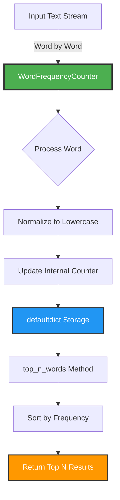

# 📊 Word Frequency Counter


## 🎯 Problem Statement

Design an object-oriented solution that processes a stream of words and maintains a real-time count of the most frequently occurring words. The system must support configurable top-N retrieval and efficient word-by-word updates.

## 🏗️ Architecture



## 💡 Solution Overview

This implementation uses a **class-based design** with the following key features:

- **Encapsulation**: Internal word counts managed within the class
- **Configurability**: Customizable `n` parameter (default: 10)
- **Efficiency**: O(1) word insertion, O(n log n) retrieval
- **Scalability**: Can process unlimited word streams

### Key Components

| Component      | Purpose                                | Time Complexity |
| -------------- | -------------------------------------- | --------------- |
| `__init__`     | Initialize counter with configurable n | O(1)            |
| `process_word` | Normalize and count individual words   | O(1)            |
| `top_n_words`  | Retrieve most frequent words           | O(n log n)      |

## 🔄 Data Flow Animation

```
Stream: ["the", "quick", "brown", "fox", "the", "fox"]
         ↓
    process_word("the")   → {"the": 1}
         ↓
    process_word("quick") → {"the": 1, "quick": 1}
         ↓
    process_word("brown") → {"the": 1, "quick": 1, "brown": 1}
         ↓
    process_word("fox")   → {"the": 1, "quick": 1, "brown": 1, "fox": 1}
         ↓
    process_word("the")   → {"the": 2, "quick": 1, "brown": 1, "fox": 1}
         ↓
    process_word("fox")   → {"the": 2, "quick": 1, "brown": 1, "fox": 2}
         ↓
    top_n_words(2)        → [("the", 2), ("fox", 2)]
```

## 🚀 How to Run

### Prerequisites

```bash
Python 3.8 or higher
```

### Execution

```bash
cd project-1
python script.py
```

### Expected Output

```python
[('the', 3), ('fox', 2), ('quick', 2), ('brown', 1), ('jumps', 1),
 ('over', 1), ('lazy', 1), ('dog', 1), ('was', 1)]
```

## 📝 Usage Example

```python
from script import WordFrequencyCounter

# Initialize with top-5 configuration
counter = WordFrequencyCounter(n=5)

# Process words from any source
text = "hello world hello python world world"
for word in text.split():
    counter.process_word(word)

# Get top 5 most frequent words
results = counter.top_n_words()
print(results)  # [('world', 3), ('hello', 2), ('python', 1)]
```

## 🔧 Technical Details

### Why `defaultdict`?

- **Automatic initialization**: No need to check if key exists
- **Cleaner code**: Eliminates boilerplate key-checking logic
- **Performance**: Constant-time lookups and updates

### Algorithm Complexity

```
Space Complexity:  O(m) where m = unique words
Time Complexity:
  - process_word():   O(1) average case
  - top_n_words():    O(m log m) for sorting
```

### Design Principles Applied

✅ **Single Responsibility**: Class handles only word frequency counting  
✅ **Encapsulation**: Internal state hidden from external access  
✅ **Configurability**: Flexible n parameter  
✅ **Extensibility**: Easy to add filtering or stemming

## 🎓 Key Learnings

1. **OOP Benefits**: State management and method organization
2. **Data Structures**: `defaultdict` for efficient counting
3. **Sorting**: Lambda functions for custom sort keys
4. **Type Hints**: Better code documentation and IDE support

## 📊 Performance Characteristics

| Operation      | Best Case  | Average Case | Worst Case |
| -------------- | ---------- | ------------ | ---------- |
| Insert         | O(1)       | O(1)         | O(1)       |
| Retrieve Top-N | O(n log n) | O(n log n)   | O(n log n) |
| Memory         | O(m)       | O(m)         | O(m)       |

_where m = unique words, n = total words_

---

**Author**: Luthando Candlovu  
**Year**: 2026  
**Challenge**: SARAO Technical Assessment
