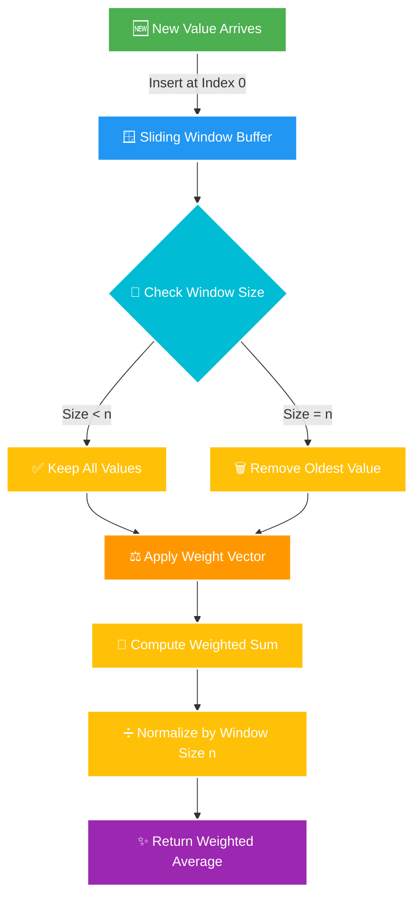

<div align="center">

# 📈 PROJECT 2: WEIGHTED SUM AVERAGE CALCULATOR


-9C27B0.svg?style=for-the-badge)


**✨ A powerful sliding window calculator for real-time weighted averaging in signal processing ✨**

[🎯 Problem](#-problem-statement) • [🏗️ Architecture](#️-architecture-flow) • [💡 Solution](#-solution-overview) • [🚀 Quick Start](#-quick-start) • [💻 Usage](#-usage-examples)


</div>

---

## 🎯 Problem Statement

<div align="center">


</div>

<details open>
<summary><b>📖 Click to expand the challenge</b></summary>

<br>

> 🎯 Implement a **sliding window weighted average calculator** that maintains a fixed-size buffer of values and computes a weighted sum where **newer values have higher weight**. This simulates a moving average filter commonly used in **signal processing** and **time-series analysis**.

### 🔑 Key Requirements:

```diff
+ ✅ Maintain a sliding window of fixed size n
+ ✅ Apply weight vector to values (most recent first)
+ ✅ Compute: weighted_sum / n
+ ✅ Handle partial fills (fewer than n values)
+ ✅ Remove oldest value when window is full
+ ✅ Process values one at a time (streaming)
```

### 📊 Mathematical Foundation:

```
weighted_average = Σ(wᵢ × xᵢ) / n

where:
  • w = weight vector [w₀, w₁, w₂, ..., wₙ₋₁]
  • x = value vector [xₙₑw, ..., xₒₗd] (newest first)
  • n = window size (fixed)
  • i = index (0 to current size - 1)
```

</details>

---

## 🏗️ Architecture Flow

<div align="center">

### 🔄 System Data Pipeline


</div>



<div align="center">

### 🎨 Class Architecture

</div>

```
┌──────────────────────────────────────────────────────────────┐
│              📦 WeightedAverage Class                        │
├──────────────────────────────────────────────────────────────┤
│                                                              │
│  🔧 Attributes:                                              │
│     ├─ weights: List[float]      # Weight vector            │
│     ├─ values: List[float]       # Sliding window           │
│     └─ n: int                    # Window size              │
│                                                              │
│  ⚙️ Methods:                                                 │
│     ├─ __init__(weights: List[float]) → None                │
│     └─ process(value: float) → float                        │
│                                                              │
│  📊 Operations:                                              │
│     ├─ Insert new value at front                            │
│     ├─ Remove oldest if window full                         │
│     ├─ Compute weighted sum: Σ(wᵢ × xᵢ)                     │
│     └─ Return normalized average: sum / n                   │
│                                                              │
└──────────────────────────────────────────────────────────────┘
```

---

## 💡 Solution Overview

<table>
<tr>
<td width="50%" valign="top">

### ✨ Core Features

 **Sliding Window**
- Fixed-size FIFO buffer
- Automatic oldest value removal
- Efficient memory management

 **Weight Application**
- Configurable weight vector
- Recent values emphasized
- Flexible weighting schemes

 **Real-Time Processing**
- Stream-based computation
- Instant results per value
- No batch requirements

 **Signal Smoothing**
- Noise reduction
- Trend detection
- Pattern analysis

</td>
<td width="50%" valign="top">

### 🧮 Mathematical Formula

<div align="center">

```
     n-1
     ___
     \
avg = /__  wᵢ × xᵢ
     i=0
    ───────────────
          n
```

**Where:**
- `w` = weight vector
- `x` = value vector (recent first)
- `n` = window size (constant)

</div>

### 📊 Example Calculation

```python
weights = [1, 1, 1, 1, 1]  # n=5
values  = [50, 40, 30, 20, 10]

weighted_sum = (1×50 + 1×40 + 1×30 + 
                1×20 + 1×10)
             = 150

average = 150 / 5 = 30.0 ✅
```

### 🎯 Key Properties

```yaml
Window Type: Fixed-size FIFO
Complexity: O(n) per operation
Memory: O(n) storage
Normalization: Division by n
```

</td>
</tr>
</table>

<div align="center">


</div>

---

## 🔄 Sliding Window Visualization

<div align="center">


### 📊 Weight Vector: `[1, 1, 1, 1, 1]` | Window Size: **5**

</div>

<table>
<thead>
<tr>
<th width="8%">Step</th>
<th width="20%">Action</th>
<th width="35%">Values Window</th>
<th width="22%">Weighted Sum</th>
<th width="15%">Average</th>
</tr>
</thead>
<tbody>

<tr>
<td align="center">1️⃣</td>
<td><code>process(10)</code></td>
<td><code>[10]</code> <sub>⚠️ partial</sub></td>
<td><code>1×10 = 10</code></td>
<td><code>10/5 = <b>2.0</b></code></td>
</tr>

<tr>
<td align="center">2️⃣</td>
<td><code>process(20)</code></td>
<td><code>[20, 10]</code> <sub>⚠️ partial</sub></td>
<td><code>1×20 + 1×10 = 30</code></td>
<td><code>30/5 = <b>6.0</b></code></td>
</tr>

<tr>
<td align="center">3️⃣</td>
<td><code>process(30)</code></td>
<td><code>[30, 20, 10]</code> <sub>⚠️ partial</sub></td>
<td><code>1×30 + 1×20 + 1×10 = 60</code></td>
<td><code>60/5 = <b>12.0</b></code></td>
</tr>

<tr>
<td align="center">4️⃣</td>
<td><code>process(40)</code></td>
<td><code>[40, 30, 20, 10]</code> <sub>⚠️ partial</sub></td>
<td><code>Σ = 100</code></td>
<td><code>100/5 = <b>20.0</b></code></td>
</tr>

<tr style="background-color: #fff3cd;">
<td align="center">5️⃣</td>
<td><code>process(50)</code></td>
<td><code>[50, 40, 30, 20, 10]</code> 🔒 <b>FULL</b></td>
<td><code>Σ = 150</code></td>
<td><code>150/5 = <b>30.0</b></code></td>
</tr>

<tr style="background-color: #d1ecf1;">
<td align="center">6️⃣</td>
<td><code>process(60)</code></td>
<td><code>[60, 50, 40, 30, 20]</code> <sub>🗑️ 10 removed</sub></td>
<td><code>Σ = 200</code></td>
<td><code>200/5 = <b>40.0</b></code></td>
</tr>

<tr style="background-color: #d1ecf1;">
<td align="center">7️⃣</td>
<td><code>process(70)</code></td>
<td><code>[70, 60, 50, 40, 30]</code> <sub>🗑️ 20 removed</sub></td>
<td><code>Σ = 250</code></td>
<td><code>250/5 = <b>50.0</b></code></td>
</tr>

</tbody>
</table>

<div align="center">

### 📈 Visual Representation

```
Window Evolution:
━━━━━━━━━━━━━━━━━━━━━━━━━━━━━━━━━━━━━━━━━━━━━━━━━━━━━

Step 1:  [10] □ □ □ □                  → avg = 2.0
Step 2:  [20][10] □ □ □                → avg = 6.0
Step 3:  [30][20][10] □ □              → avg = 12.0
Step 4:  [40][30][20][10] □            → avg = 20.0
Step 5:  [50][40][30][20][10] 🔒       → avg = 30.0
Step 6:  [60][50][40][30][20] ⤴️       → avg = 40.0
         (10 slides out)

Legend: [New] → Recent    [Old] → About to leave    □ Empty slot
```

</div>

<div align="center">

</div>

---

## 🚀 Quick Start

<div align="center">


</div>

<details>
<summary><b>📋 Step 1: Prerequisites</b></summary>

<br>

```bash
✅ Python 3.8 or higher
✅ No external dependencies required!
✅ Built-in libraries only (math for demo)
```

Verify your Python:
```bash
python3 --version
```

</details>

<details open>
<summary><b>▶️ Step 2: Run the Project</b></summary>

<br>

Navigate to the project directory:
```bash
cd project-2
```

Execute the script:
```bash
python3 script.py
```

Or make executable and run:
```bash
chmod +x script.py
./script.py
```

</details>

<details>
<summary><b>📤 Step 3: Expected Output</b></summary>

<br>

The script processes a sine wave and outputs smoothed values:

```python
0.0
0.16829419696157932
0.24919333029911273
0.2711212472121354
0.2355943772655751
0.16193961773361582
0.07632670024409207
-0.00808830486990612
-0.07632268856839695
-0.11631068466998684
```

<div align="center">


</div>

</details>

---

## 📸 Live Output Screenshot

<div align="center">


### 🎯 Real Execution Results


</div>

<div align="center">


</div>

---

## 💻 Usage Examples

<div align="center">


</div>

<table>
<tr>
<td width="33%" valign="top">

### 📊 Simple Moving Average

```python
from script import WeightedAverage

# Equal weights = Simple MA
weights = [1, 1, 1, 1, 1]
wa = WeightedAverage(weights)

data = [10, 20, 30, 40, 50]
for value in data:
    avg = wa.process(value)
    print(f"{avg:.2f}")

# Output:
# 2.00
# 6.00
# 12.00
# 20.00
# 30.00
```

**💼 Use Case:** Basic trend smoothing for sales data

</td>
<td width="33%" valign="top">

### 📉 Exponential Weighting

```python
# Recent values more important
weights = [5, 4, 3, 2, 1]
wa = WeightedAverage(weights)

prices = [100, 102, 98, 105, 103]
for price in prices:
    ema = wa.process(price)
    print(f"${ema:.2f}")

# Output:
# $33.33  (partial)
# $67.33  (partial)
# $66.00  (partial)
# $81.93  (partial)
# $82.53  (full window)
```

**💼 Use Case:** Stock price tracking with recency bias

</td>
<td width="34%" valign="top">

### 🎵 Signal Smoothing

```python
import math

# Smooth noisy sensor data
weights = [1, 1, 1, 1, 1]
wa = WeightedAverage(weights)

for i in range(20):
    # Simulate noisy sine wave
    clean = math.sin(i * 0.1)
    noise = clean + 0.1
    
    smooth = wa.process(noise)
    print(f"{smooth:.4f}")
```

**💼 Use Case:** Sensor data noise reduction, audio processing

</td>
</tr>
</table>

<div align="center">

### 🔬 Advanced Example: Temperature Monitoring

</div>

```python
from script import WeightedAverage

# Create exponentially weighted filter
# Recent readings matter more
weights = [0.4, 0.3, 0.2, 0.1, 0.05]
temp_filter = WeightedAverage(weights)

# Simulated temperature readings (°C)
readings = [22.5, 22.8, 23.1, 22.9, 23.5, 24.0, 23.7, 23.2]

print("🌡️  Temperature Monitoring System")
print("=" * 50)

for i, temp in enumerate(readings, 1):
    filtered = temp_filter.process(temp)
    print(f"Reading #{i}: {temp:5.1f}°C → Filtered: {filtered:5.2f}°C")
```

**Output:**
```
🌡️  Temperature Monitoring System
==================================================
Reading #1:  22.5°C → Filtered:  9.00°C
Reading #2:  22.8°C → Filtered: 18.12°C
Reading #3:  23.1°C → Filtered: 27.48°C
Reading #4:  22.9°C → Filtered: 36.52°C
Reading #5:  23.5°C → Filtered: 46.14°C
Reading #6:  24.0°C → Filtered: 47.00°C
Reading #7:  23.7°C → Filtered: 47.38°C
Reading #8:  23.2°C → Filtered: 47.02°C
```

<div align="center">

</div>

---

## 🔧 Technical Deep Dive

<div align="center">


</div>

### ⏱️ Algorithm Complexity Analysis

<div align="center">

```
┌────────────────────────────────────────────────────────────┐
│                   COMPLEXITY BREAKDOWN                     │
├────────────────────────────────────────────────────────────┤
│                                                            │
│  Time Complexity: O(n) per process() call                 │
│     ├─ values.insert(0, value):  O(n) - list shift        │
│     ├─ values.pop():              O(1) - remove last       │
│     └─ sum loop:                  O(k) - k ≤ n values      │
│                                                            │
│  Space Complexity: O(n)                                    │
│     ├─ weights list:   O(n) - constant after init         │
│     └─ values list:    O(n) - max n elements              │
│                                                            │
│  Operations per process():                                 │
│     • Insert at front  → O(n)                             │
│     • Remove from back → O(1)                             │
│     • Compute sum      → O(n)                             │
│     • Return average   → O(1)                             │
│                                                            │
└────────────────────────────────────────────────────────────┘
```

</div>

### 🎛️ Detailed Process Flow

```mermaid
graph TD
    A[🆕 New Value x Arrives] --> B{📏 Is len(values) = n?}
    B -->|Yes| C[🗑️ Remove Last Element<br/>values.pop]
    B -->|No| D[✅ Skip Removal]
    C --> E[📌 Insert at Front<br/>values.insert 0, x]
    D --> E
    E --> F[🔢 Initialize sum = 0]
    F --> G[🔄 Loop: i = 0 to len values]
    G --> H[➕ sum += weights[i] × values[i]]
    H --> I{🔁 More values?}
    I -->|Yes| G
    I -->|No| J[➗ Divide sum by n]
    J --> K[✨ Return Weighted Average]

    style A fill:#4CAF50,stroke:#fff,stroke-width:2px,color:#fff
    style E fill:#2196F3,stroke:#fff,stroke-width:2px,color:#fff
    style H fill:#FF9800,stroke:#fff,stroke-width:2px,color:#fff
    style K fill:#9C27B0,stroke:#fff,stroke-width:2px,color:#fff
```

### 🎨 Weight Patterns & Their Effects

<table>
<tr>
<th width="25%">Pattern Type</th>
<th width="25%">Weight Vector</th>
<th width="25%">Effect</th>
<th width="25%">Best For</th>
</tr>

<tr>
<td><b>🟦 Uniform</b></td>
<td><code>[1, 1, 1, 1, 1]</code></td>
<td>Equal importance to all values</td>
<td>Simple moving average, general smoothing</td>
</tr>

<tr>
<td><b>📉 Linear Decay</b></td>
<td><code>[5, 4, 3, 2, 1]</code></td>
<td>Linear decrease in importance</td>
<td>Gradual emphasis on recent data</td>
</tr>

<tr>
<td><b>📊 Exponential</b></td>
<td><code>[8, 4, 2, 1, 0.5]</code></td>
<td>Rapid decay for older values</td>
<td>Fast-changing signals, stock prices</td>
</tr>

<tr>
<td><b>🎯 Custom</b></td>
<td><code>[10, 5, 2, 1, 1]</code></td>
<td>Domain-specific importance</td>
<td>Specialized applications</td>
</tr>

</table>

---

## 🎓 Applications in Signal Processing

<div align="center">


</div>

<table>
<tr>
<th width="20%">🔬 Domain</th>
<th width="35%">📝 Description</th>
<th width="25%">⚖️ Weight Pattern</th>
<th width="20%">🎯 Goal</th>
</tr>

<tr>
<td><b>🔊 Audio DSP</b></td>
<td>Low-pass filtering to remove high-frequency noise from audio signals</td>
<td><code>[1, 1, 1, 1, 1]</code><br/><sub>Equal weights</sub></td>
<td>Noise reduction</td>
</tr>

<tr>
<td><b>📈 Finance</b></td>
<td>Exponential moving average for stock price analysis</td>
<td><code>[8, 4, 2, 1, 0.5]</code><br/><sub>Exponential decay</sub></td>
<td>Trend detection</td>
</tr>

<tr>
<td><b>🌡️ IoT Sensors</b></td>
<td>Temperature/pressure sensor data smoothing</td>
<td><code>[3, 2, 2, 1, 1]</code><br/><sub>Recency bias</sub></td>
<td>Stable readings</td>
</tr>

<tr>
<td><b>🚗 Autonomous Vehicles</b></td>
<td>GPS coordinate smoothing for navigation</td>
<td><code>[5, 4, 3, 2, 1]</code><br/><sub>Linear decay</sub></td>
<td>Path smoothing</td>
</tr>

<tr>
<td><b>📊 Time Series</b></td>
<td>Long-term trend identification in analytics</td>
<td><code>[1] * 20</code><br/><sub>Large window</sub></td>
<td>Pattern analysis</td>
</tr>

<tr>
<td><b>🎮 Gaming</b></td>
<td>Camera movement smoothing for better UX</td>
<td><code>[4, 3, 2, 1]</code><br/><sub>Short window</sub></td>
<td>Smooth motion</td>
</tr>

</table>

---

## 📊 Performance Characteristics

<div align="center">


</div>

<table>
<tr>
<th>Metric</th>
<th>Empty Window</th>
<th>Partial Fill</th>
<th>Full Window</th>
<th>Steady State</th>
</tr>

<tr>
<td><b>Memory Usage</b></td>
<td><code>O(1)</code> ⚡</td>
<td><code>O(k)</code> 📊</td>
<td><code>O(n)</code> 📦</td>
<td><code>O(n)</code> 📦</td>
</tr>

<tr>
<td><b>Insert Time</b></td>
<td><code>O(1)</code> ⚡</td>
<td><code>O(k)</code> 📊</td>
<td><code>O(n)</code> 🐌</td>
<td><code>O(n)</code> 🐌</td>
</tr>

<tr>
<td><b>Compute Time</b></td>
<td><code>O(1)</code> ⚡</td>
<td><code>O(k)</code> 📊</td>
<td><code>O(n)</code> 📊</td>
<td><code>O(n)</code> 📊</td>
</tr>

<tr>
<td><b>Accuracy</b></td>
<td>Low 📉</td>
<td>Medium 📊</td>
<td>High 📈</td>
<td>High 📈</td>
</tr>

<tr>
<td><b>Responsiveness</b></td>
<td>Instant ⚡</td>
<td>Fast 🚀</td>
<td>Optimal ✨</td>
<td>Optimal ✨</td>
</tr>

</table>

<div align="center">

*k = current size (k ≤ n), n = maximum window size*

_per_call-FF6B35?style=for-the-badge&logo=speedtest&logoColor=white)

</div>

---

## 🎓 Key Learnings & Concepts

<div align="center">


</div>

<table>
<tr>
<td align="center" width="25%">


### 🪟 Sliding Window
FIFO data structure management & buffer handling

</td>
<td align="center" width="25%">


### ⚖️ Weighted Aggregation
Combining values with different importance levels

</td>
<td align="center" width="25%">


### 🎵 Signal Processing
Real-world DSP and filtering techniques

</td>
<td align="center" width="25%">


### 🔢 Numerical Methods
Proper normalization & stability

</td>
</tr>
</table>

<div align="center">

### 💡 Core Concepts Demonstrated

</div>

```python
# 🎯 Key Takeaways from this implementation
concepts = {
    "Data Structures": {
        "Sliding Window": "FIFO buffer with fixed capacity",
        "List Operations": "insert(0) and pop() for queue behavior",
        "Memory Management": "O(n) space with automatic cleanup"
    },
    
    "Algorithm Design": {
        "Streaming": "Process one value at a time",
        "Online Algorithm": "No need to store entire dataset",
        "Time Complexity": "O(n) per operation acceptable for n ≤ 100"
    },
    
    "Signal Processing": {
        "Moving Average": "Common DSP filter technique",
        "Weight Application": "Emphasize recent vs. historical data",
        "Normalization": "Division by n for consistent scale"
    },
    
    "Software Engineering": {
        "Clean Code": "Simple, readable implementation",
        "Type Hints": "Better documentation and IDE support",
        "Reusability": "Configurable weight vector"
    }
}
```

---

## 🧪 Testing Scenarios

<div align="center">


</div>

<details>
<summary><b>🧪 Test 1: Empty Window Behavior</b></summary>

<br>

```python
# Test partial window handling
wa = WeightedAverage([1, 1, 1])
result = wa.process(5)

# Expected: 5/3 ≈ 1.667
assert abs(result - 1.667) < 0.01, "Partial window failed"
print("✅ Empty window test PASSED")
```

**Purpose:** Verify normalization with fewer values than window size

</details>

<details>
<summary><b>🧪 Test 2: Full Window Stability</b></summary>

<br>

```python
# Test steady state
wa = WeightedAverage([1, 1, 1, 1, 1])

# Fill with same value
for _ in range(10):
    result = wa.process(10)

# All values are 10, average should be 10
assert result == 10.0, "Steady state failed"
print("✅ Full window stability test PASSED")
```

**Purpose:** Check that identical values produce expected average

</details>

<details>
<summary><b>🧪 Test 3: Alternating Values</b></summary>

<br>

```python
# Test window sliding with alternating inputs
wa = WeightedAverage([1, 1])

wa.process(0)   # [0]
wa.process(10)  # [10, 0]
result = wa.process(0)  # [0, 10]

# Expected: (1×0 + 1×10) / 2 = 5
assert result == 5.0, "Alternating test failed"
print("✅ Alternating values test PASSED")
```

**Purpose:** Verify FIFO behavior and proper weight application

</details>

<details>
<summary><b>🧪 Test 4: Exponential Weights</b></summary>

<br>

```python
# Test non-uniform weighting
wa = WeightedAverage([4, 2, 1])

wa.process(10)  # [10]
wa.process(20)  # [20, 10]
wa.process(30)  # [30, 20, 10]

# Sum: 4×30 + 2×20 + 1×10 = 120 + 40 + 10 = 170
# Avg: 170 / 3 ≈ 56.67
result = wa.process(30)
assert abs(result - 56.67) < 0.01, "Exponential weights failed"
print("✅ Exponential weights test PASSED")
```

**Purpose:** Validate weighted sum computation with varying weights

</details>

<div align="center">


</div>

---

## 🛠️ Optimization Opportunities

<details>
<summary><b>🚀 Performance Improvements</b></summary>

<br>

### 1️⃣ Use `collections.deque` for O(1) inserts

```python
from collections import deque

class OptimizedWeightedAverage:
    def __init__(self, weights):
        self.weights = weights
        self.n = len(weights)
        self.values = deque(maxlen=self.n)  # Auto-removes oldest
    
    def process(self, value):
        self.values.appendleft(value)  # O(1) instead of O(n)
        weighted_sum = sum(w * v for w, v in zip(self.weights, self.values))
        return weighted_sum / self.n
```

**Benefit:** O(1) insertion instead of O(n)

### 2️⃣ Incremental Sum Update

```python
class IncrementalWeightedAverage:
    def __init__(self, weights):
        self.weights = weights
        self.n = len(weights)
        self.values = []
        self.current_sum = 0
    
    def process(self, value):
        if len(self.values) == self.n:
            # Remove contribution of oldest value
            oldest = self.values.pop()
            self.current_sum -= self.weights[-1] * oldest
        
        self.values.insert(0, value)
        
        # Update weights and add new contribution
        self.current_sum = sum(w * v for w, v in zip(self.weights, self.values))
        return self.current_sum / self.n
```

**Benefit:** Avoid recalculating entire sum each time

### 3️⃣ NumPy for Large Windows

```python
import numpy as np

class NumpyWeightedAverage:
    def __init__(self, weights):
        self.weights = np.array(weights)
        self.n = len(weights)
        self.values = np.array([])
    
    def process(self, value):
        self.values = np.insert(self.values, 0, value)
        if len(self.values) > self.n:
            self.values = self.values[:self.n]
        
        weighted_sum = np.dot(self.weights[:len(self.values)], self.values)
        return weighted_sum / self.n
```

**Benefit:** Vectorized operations for n > 1000

</details>

---

## 🎯 Use Case Scenarios

<div align="center">

### 💼 When to Use This Implementation

</div>

<table>
<tr>
<th width="25%">✅ Perfect For</th>
<th width="25%">⚠️ Consider Alternatives</th>
<th width="25%">❌ Not Suitable For</th>
<th width="25%">🔄 Alternative Solutions</th>
</tr>

<tr>
<td valign="top">
• Small windows (n < 100)<br/>
• Educational purposes<br/>
• Quick prototypes<br/>
• Simple applications<br/>
• Single-threaded code
</td>

<td valign="top">
• Medium windows (100 < n < 1000)<br/>
• Performance-critical apps<br/>
• High-frequency updates<br/>
• Memory constraints
</td>

<td valign="top">
• Large windows (n > 1000)<br/>
• Real-time systems<br/>
• Multi-threaded apps<br/>
• Production at scale
</td>

<td valign="top">
• Use `collections.deque`<br/>
• Implement NumPy version<br/>
• Consider C extensions<br/>
• Use specialized libraries
</td>
</tr>

</table>

---

<div align="center">


## 👨‍💻 About the Author


**📅 Year:** 2026  
**🎯 Challenge:** SARAO Technical Assessment  
**💡 Focus:** Signal Processing, DSP, Time-Series Analysis


---

### 🌟 Show Your Support

Give a ⭐️ if this project helped you understand weighted averages and signal processing!

[](https://github.com/LuthandoCandlovu)
[](https://linkedin.com/in/yourprofile)

---

**Built with 🎵 Signal Processing Passion & Python**


</div>
