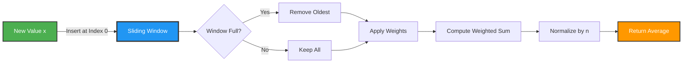
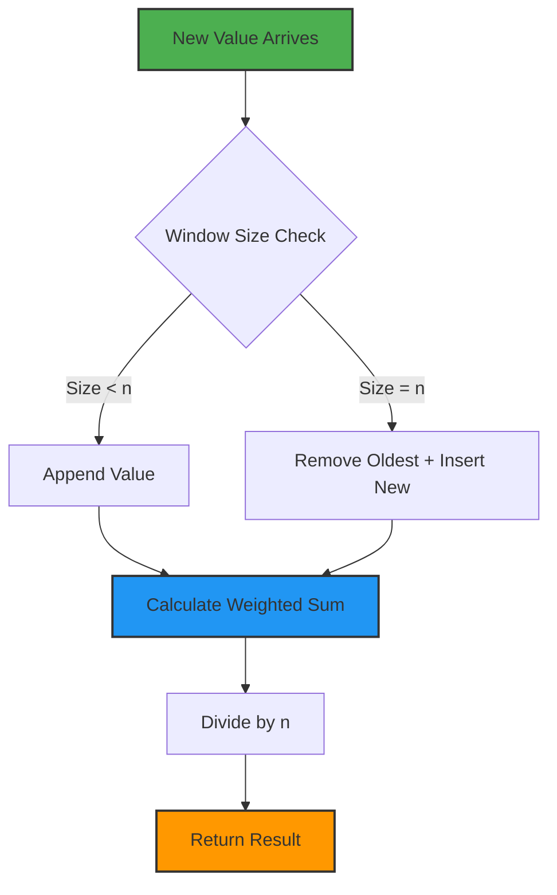

# 📈 Weighted Sum Average Calculator


## 🎯 Problem Statement

Implement a sliding window weighted average calculator that maintains a fixed-size buffer of values and computes a weighted sum where newer values have higher weight. This simulates a moving average filter commonly used in signal processing and time-series analysis.

## 🏗️ Architecture



## 💡 Solution Overview

This implementation provides a **weighted moving average** with these characteristics:

- **Sliding Window**: Fixed-size buffer (FIFO behavior)
- **Weight Application**: Configurable weight vector
- **Normalization**: Division by window size for averaging
- **Signal Processing**: Ideal for smoothing noisy time-series data

### Mathematical Formula

```
weighted_avg = (w₀·x₀ + w₁·x₁ + w₂·x₂ + ... + wₙ·xₙ) / n

where:
  w = weight vector
  x = value vector (most recent first)
  n = window size
```

## 🔄 Sliding Window Visualization

```
Weights: [1, 1, 1, 1, 1]  (window size = 5)

Step 1: process(10)
  Values: [10]
  Weighted Sum: 1×10 = 10
  Average: 10/5 = 2.0

Step 2: process(20)
  Values: [20, 10]
  Weighted Sum: 1×20 + 1×10 = 30
  Average: 30/5 = 6.0

Step 3: process(30)
  Values: [30, 20, 10]
  Weighted Sum: 1×30 + 1×20 + 1×10 = 60
  Average: 60/5 = 12.0

Step 4: process(40)
  Values: [40, 30, 20, 10]
  Weighted Sum: 1×40 + 1×30 + 1×20 + 1×10 = 100
  Average: 100/5 = 20.0

Step 5: process(50)
  Values: [50, 40, 30, 20, 10]  ← Window FULL
  Weighted Sum: 1×50 + 1×40 + 1×30 + 1×20 + 1×10 = 150
  Average: 150/5 = 30.0

Step 6: process(60)
  Values: [60, 50, 40, 30, 20]  ← Oldest (10) removed
  Weighted Sum: 1×60 + 1×50 + 1×40 + 1×30 + 1×20 = 200
  Average: 200/5 = 40.0
```

## 🚀 How to Run

### Prerequisites

```bash
Python 3.8 or higher
```

### Execution

```bash
cd project-2
python script.py
```

### Expected Output

```python
0.0
0.16829419696157932
0.24919333029911273
0.2711212472121354
0.2355943772655751
0.16193961773361582
0.07632670024409207
-0.00808830486990612
-0.07632268856839695
-0.11631068466998684
```

## 📝 Usage Examples

### Example 1: Simple Moving Average

```python
from script import WeightedAverage

# Equal weights = simple moving average
weights = [1, 1, 1, 1, 1]
wa = WeightedAverage(weights)

for value in [10, 20, 30, 40, 50]:
    print(wa.process(value))
```

### Example 2: Exponential Weighting

```python
# Higher weight for recent values
weights = [5, 4, 3, 2, 1]
wa = WeightedAverage(weights)

for value in range(10):
    print(wa.process(value))
```

### Example 3: Signal Smoothing

```python
import math

# Smooth noisy sine wave
weights = [1, 1, 1, 1, 1]
wa = WeightedAverage(weights)

for i in range(100):
    noisy_signal = math.sin(i * 0.1) + random.uniform(-0.1, 0.1)
    smoothed = wa.process(noisy_signal)
    print(f"Original: {noisy_signal:.4f}, Smoothed: {smoothed:.4f}")
```

## 🔧 Technical Details

### Algorithm Complexity

```
Time Complexity:
  - process():  O(n) where n = window size
  - insert(0):  O(n) for list shift
  - pop():      O(1)
  - sum loop:   O(n)

Space Complexity: O(n) for value storage
```

## 🎓 Applications in Signal Processing

### 1. **Low-Pass Filter**

Removes high-frequency noise from signals

```python
weights = [1, 1, 1, 1, 1]  # Simple moving average
```

### 2. **Exponential Moving Average (EMA)**

Gives more weight to recent data

```python
weights = [8, 4, 2, 1, 0.5]  # Exponential decay
```

### 3. **Trend Detection**

Identify trends in time-series data

```python
# Long window for smooth trends
weights = [1] * 20
```

## 🎯 Key Learnings

1. **Sliding Window Pattern**: FIFO data structure management
2. **Weighted Aggregation**: Combining values with different importance
3. **Signal Processing**: Real-world application of moving averages
4. **Numerical Stability**: Proper normalization prevents overflow

## 📊 Performance Characteristics



## 🧪 Testing Scenarios

```python
# Test 1: Empty window behavior
wa = WeightedAverage([1, 1, 1])
assert wa.process(5) == 5/3

# Test 2: Full window stability
for _ in range(10):
    wa.process(10)
assert wa.process(10) == 10  # All values are 10

# Test 3: Alternating values
wa = WeightedAverage([1, 1])
wa.process(0)
wa.process(10)
assert wa.process(0) == 5  # (1×0 + 1×10)/2
```

---

**Author**: Luthando Candlovu  
**Year**: 2026  
**Challenge**: SARAO Technical Assessment
