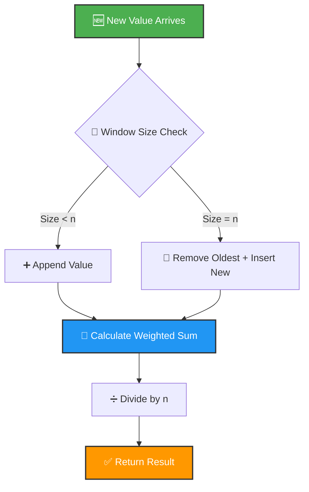

<div align="center">

# 📈 Weighted Sum Average Calculator


</div>

---

## 🎯 Problem Statement

<details open>
<summary><b>Click to expand</b></summary>

> Implement a **sliding window weighted average calculator** that maintains a fixed-size buffer of values and computes a weighted sum where **newer values have higher weight**. This simulates a moving average filter commonly used in **signal processing** and **time-series analysis**.

</details>

---

## 🏗️ Architecture Flow

<div align="center">


</div>

---

## 💡 Solution Overview

<table>
<tr>
<td width="50%">

### ✨ Core Features

- 🪟 **Sliding Window** - Fixed-size buffer (FIFO behavior)
- ⚖️ **Weight Application** - Configurable weight vector
- 📊 **Normalization** - Division by window size
- 🎵 **Signal Processing** - Ideal for smoothing noisy data

</td>
<td width="50%">

### 🧮 Mathematical Formula

```
weighted_avg = Σ(wᵢ·xᵢ) / n

where:
  w = weight vector
  x = value vector (recent first)
  n = window size
```

</td>
</tr>
</table>

<div align="center">

</div>

---

## 🔄 Sliding Window Visualization

<div align="center">

### 📊 Weights: `[1, 1, 1, 1, 1]` (window size = 5)

</div>

<table>
<tr><th>Step</th><th>Action</th><th>Values Window</th><th>Weighted Sum</th><th>Average</th></tr>

<tr>
<td align="center">1️⃣</td>
<td><code>process(10)</code></td>
<td><code>[10]</code></td>
<td><code>1×10 = 10</code></td>
<td><code>10/5 = 2.0</code></td>
</tr>

<tr>
<td align="center">2️⃣</td>
<td><code>process(20)</code></td>
<td><code>[20, 10]</code></td>
<td><code>1×20 + 1×10 = 30</code></td>
<td><code>30/5 = 6.0</code></td>
</tr>

<tr>
<td align="center">3️⃣</td>
<td><code>process(30)</code></td>
<td><code>[30, 20, 10]</code></td>
<td><code>1×30 + 1×20 + 1×10 = 60</code></td>
<td><code>60/5 = 12.0</code></td>
</tr>

<tr>
<td align="center">4️⃣</td>
<td><code>process(40)</code></td>
<td><code>[40, 30, 20, 10]</code></td>
<td><code>1×40 + 1×30 + 1×20 + 1×10 = 100</code></td>
<td><code>100/5 = 20.0</code></td>
</tr>

<tr style="background-color: #fff3cd;">
<td align="center">5️⃣</td>
<td><code>process(50)</code></td>
<td><code>[50, 40, 30, 20, 10]</code> 🔒 <b>FULL</b></td>
<td><code>150</code></td>
<td><code>150/5 = 30.0</code></td>
</tr>

<tr style="background-color: #d1ecf1;">
<td align="center">6️⃣</td>
<td><code>process(60)</code></td>
<td><code>[60, 50, 40, 30, 20]</code> ⚠️ <i>10 removed</i></td>
<td><code>200</code></td>
<td><code>200/5 = 40.0</code></td>
</tr>

</table>

---

## 🚀 Quick Start

<details>
<summary><b>📋 Prerequisites</b></summary>

```bash
Python 3.8 or higher
```

</details>

<details>
<summary><b>▶️ Run the Project</b></summary>

```bash
cd project-2
python script.py
```

</details>

<details open>
<summary><b>📤 Expected Output</b></summary>

```python
0.0
0.16829419696157932
0.24919333029911273
0.2711212472121354
0.2355943772655751
0.16193961773361582
0.07632670024409207
-0.00808830486990612
-0.07632268856839695
-0.11631068466998684
```

</details>

<div align="center">

## 📸 Sample Output


</div>

---

## 💻 Usage Examples

<table>
<tr>
<td width="33%">

### 📊 Simple Moving Average

```python
from script import WeightedAverage

# Equal weights
weights = [1, 1, 1, 1, 1]
wa = WeightedAverage(weights)

for value in [10, 20, 30, 40, 50]:
    print(wa.process(value))
```

**Use Case:** Basic trend smoothing

</td>
<td width="33%">

### 📉 Exponential Weighting

```python
# Recent values matter more
weights = [5, 4, 3, 2, 1]
wa = WeightedAverage(weights)

for value in range(10):
    print(wa.process(value))
```

**Use Case:** Responsive to changes

</td>
<td width="34%">

### 🎵 Signal Smoothing

```python
import math

# Smooth noisy sine wave
weights = [1, 1, 1, 1, 1]
wa = WeightedAverage(weights)

for i in range(100):
    noisy = math.sin(i * 0.1)
    smooth = wa.process(noisy)
    print(f"{smooth:.4f}")
```

**Use Case:** Noise reduction

</td>
</tr>
</table>

<div align="center">

</div>

---

## 🔧 Technical Deep Dive

### ⏱️ Algorithm Complexity

<div align="center">

```
Time Complexity:
  ├─ process():  O(n) where n = window size
  ├─ insert(0):  O(n) for list shift
  ├─ pop():      O(1)
  └─ sum loop:   O(n)

Space Complexity: O(n) for value storage
```

</div>

### 🎛️ Performance Flow



---

## 🎓 Applications in Signal Processing

<div align="center">

| Application | Description | Weight Pattern |
|:-----------:|:------------|:---------------|
| 🔊 **Low-Pass Filter** | Removes high-frequency noise | `[1, 1, 1, 1, 1]` - Equal weights |
| 📈 **Exponential Moving Average** | More weight to recent data | `[8, 4, 2, 1, 0.5]` - Decay |
| 📊 **Trend Detection** | Identify long-term patterns | `[1] * 20` - Large window |
| 🎯 **Adaptive Filter** | Dynamic response | `[w₀, w₁, ..., wₙ]` - Custom |

</div>

---

## 🎯 Key Learnings

<table>
<tr>
<td align="center" width="25%">

### 🪟 Sliding Window
FIFO data structure management

</td>
<td align="center" width="25%">

### ⚖️ Weighted Aggregation
Combining values with different importance

</td>
<td align="center" width="25%">

### 🎵 Signal Processing
Real-world moving averages

</td>
<td align="center" width="25%">

### 🔢 Numerical Stability
Proper normalization

</td>
</tr>
</table>

<div align="center">

</div>

---

## 🧪 Testing Scenarios

<details>
<summary><b>Test 1️⃣: Empty Window Behavior</b></summary>

```python
wa = WeightedAverage([1, 1, 1])
assert wa.process(5) == 5/3  # Partial window
```

</details>

<details>
<summary><b>Test 2️⃣: Full Window Stability</b></summary>

```python
for _ in range(10):
    wa.process(10)
assert wa.process(10) == 10  # All values are 10
```

</details>

<details>
<summary><b>Test 3️⃣: Alternating Values</b></summary>

```python
wa = WeightedAverage([1, 1])
wa.process(0)
wa.process(10)
assert wa.process(0) == 5  # (1×0 + 1×10)/2
```

</details>

---

## 📊 Visual Performance Matrix

<div align="center">

| Metric | Empty Window | Partial Fill | Full Window |
|:------:|:------------:|:------------:|:-----------:|
| **Memory** | O(1) | O(k) | O(n) |
| **Insert Time** | O(1) | O(k) | O(n) |
| **Compute Time** | O(1) | O(k) | O(n) |
| **Accuracy** | Low | Medium | High |

*where k = current size, n = max size*

</div>

<div align="center">

</div>

---

<div align="center">

### 👨‍💻 Author Information

**Luthando Candlovu**  
📅 Year: 2026  
🎯 Challenge: SARAO Technical Assessment


---

### 🌟 Show Your Support

Give a ⭐️ if you found this implementation useful!

[](https://github.com/LuthandoCandlovu)

</div>

---

<div align="center">

**Built with 🎵 Signal Processing & Python**


</div>
