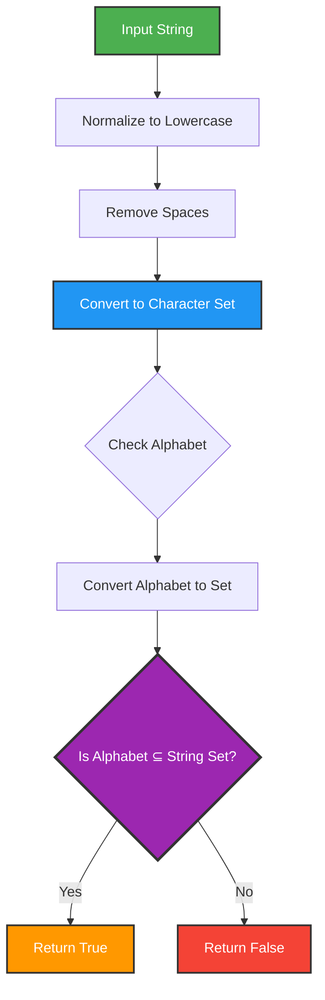
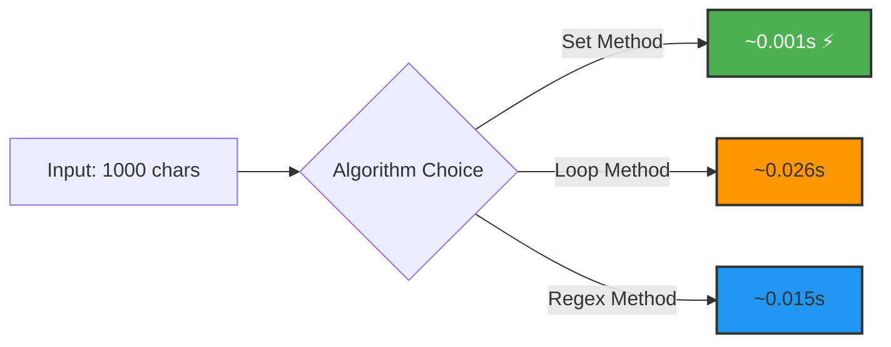

# 🔤 Pangram Checker


## 🎯 Problem Statement

A **pangram** is a sentence that contains every letter of the alphabet at least once. Design an efficient algorithm to determine whether a given string is a pangram, supporting custom alphabets and case-insensitive validation.

### Classic Pangram Example

```
"The quick brown fox jumps over the lazy dog"
✓ Contains all 26 letters: a-z
```

## 🏗️ Architecture



## 💡 Solution Overview

This implementation uses **set theory** for elegant and efficient pangram detection:

- **Set Operations**: Leverages subset checking for O(1) lookup
- **Normalization**: Case-insensitive comparison via `.lower()`
- **Flexibility**: Supports custom alphabets (Greek, Cyrillic, etc.)
- **Pythonic**: Clean, readable one-liner core logic

### Mathematical Foundation

```
Let A = set of alphabet characters
Let S = set of string characters

isPangram(S, A) ⟺ A ⊆ S

Where ⊆ represents "is a subset of"
```

## 🔄 Algorithm Visualization

```
Input: "The quick brown fox jumps over the lazy dog"
Alphabet: "abcdefghijklmnopqrstuvwxyz"

Step 1: Normalize
  "the quick brown fox jumps over the lazy dog"

Step 2: Remove Spaces
  "thequickbrownfoxjumpsoverthelazydog"

Step 3: Create Sets
  String Set:   {t,h,e,q,u,i,c,k,b,r,o,w,n,f,x,j,m,p,s,v,l,a,z,y,d,g}
  Alphabet Set: {a,b,c,d,e,f,g,h,i,j,k,l,m,n,o,p,q,r,s,t,u,v,w,x,y,z}

Step 4: Subset Check
  Is Alphabet ⊆ String? YES ✓

Result: TRUE (is a pangram)
```

## 🚀 How to Run

### Prerequisites

```bash
Python 3.8 or higher
```

### Execution

```bash
cd project-3
python script.py
```

### Expected Output

```python
True
```

## 📝 Usage Examples

### Example 1: Basic Pangram Check

```python
from script import ispangram

# Classic pangram
result = ispangram("The quick brown fox jumps over the lazy dog")
print(result)  # True

# Not a pangram
result = ispangram("Hello World")
print(result)  # False
```

### Example 2: Custom Alphabet

```python
# Check for vowels only
vowels = "aeiou"
result = ispangram("education", alphabet=vowels)
print(result)  # True (contains all vowels)

# Greek alphabet check
greek = "αβγδεζηθικλμνξοπρστυφχψω"
result = ispangram("αβγδε", alphabet=greek)
print(result)  # False (missing some letters)
```

### Example 3: Edge Cases

```python
# Empty string
ispangram("")  # False

# Numbers and special characters
ispangram("abc123!@#xyz...")  # Depends on alphabet

# Duplicate letters
ispangram("aabbccddeeffgghhii...")  # True if all present
```

## 🔧 Technical Details

### Algorithm Complexity

```
Time Complexity:  O(n + m)
  where n = string length
        m = alphabet length

Space Complexity: O(n + m)
  for storing character sets

Breakdown:
  - str.lower():        O(n)
  - str.replace():      O(n)
  - set():              O(n) and O(m)
  - issubset():         O(m) average
```

### Why Set Operations?

| Approach           | Time       | Code Complexity | Readability |
| ------------------ | ---------- | --------------- | ----------- |
| **Set subset**     | O(n+m)     | Low             | High ⭐     |
| Character counting | O(n×m)     | Medium          | Medium      |
| Boolean array      | O(n+26)    | High            | Low         |
| Sorting            | O(n log n) | Medium          | Medium      |

## 🎨 Visual Set Comparison

```
Example: "Hello World" vs "abcdefghijklmnopqrstuvwxyz"

String Set (unique chars):
┌───────────────────────────────┐
│ h, e, l, o, w, r, d           │ = 7 characters
└───────────────────────────────┘

Alphabet Set:
┌─────────────────────────────────────────────────┐
│ a,b,c,d,e,f,g,h,i,j,k,l,m,n,o,p,q,r,s,t,u,v,w,x,│
│ y,z                                              │ = 26 characters
└─────────────────────────────────────────────────┘

Missing: a,b,c,f,g,i,j,k,m,n,p,q,s,t,u,v,x,y,z
Result: NOT A PANGRAM ✗
```

## 🎓 Key Learnings

### 1. **Set Theory Application**

Using mathematical set operations for practical programming problems

### 2. **String Manipulation**

- `.lower()` for case normalization
- `.replace()` for character removal
- String comprehension alternatives

### 3. **Pythonic Code**

Clean, expressive one-liners that remain readable:

```python
return set(alphabet).issubset(set(cleaned))
```

### 4. **Default Parameters**

Using `string.ascii_lowercase` from standard library

## 📊 Performance Comparison



## 🧪 Test Cases

```python
# Comprehensive test suite
test_cases = [
    ("The quick brown fox jumps over the lazy dog", True),
    ("Pack my box with five dozen liquor jugs", True),
    ("How vexingly quick daft zebras jump", True),
    ("Hello World", False),
    ("ABCDEFGHIJKLMNOPQRSTUVWXYZ", True),
    ("abcdefghijklmnopqrstuvwxy", False),  # Missing 'z'
    ("", False),
    ("     ", False),
]

for text, expected in test_cases:
    result = ispangram(text)
    status = "✓" if result == expected else "✗"
    print(f"{status} {text[:30]}... -> {result}")
```

## 🌍 Real-World Applications

### Typography & Font Testing

```python
# Verify font contains all glyphs
font_test = "ABCDEFGHIJKLMNOPQRSTUVWXYZ0123456789"
ispangram(font_test, string.ascii_uppercase)
```

### Keyboard Testing

```python
# Check all keys work
keyboard_test = "qwertyuiopasdfghjklzxcvbnm"
ispangram(keyboard_test)  # True
```

### Cryptography

```python
# Verify encryption key space
cipher_alphabet = "abcdefghijklmnopqrstuvwxyz0123456789"
ispangram(encrypted_message, cipher_alphabet)
```

---

**Author**: Luthando Candlovu  
**Year**: 2026  
**Challenge**: SARAO Technical Assessment
