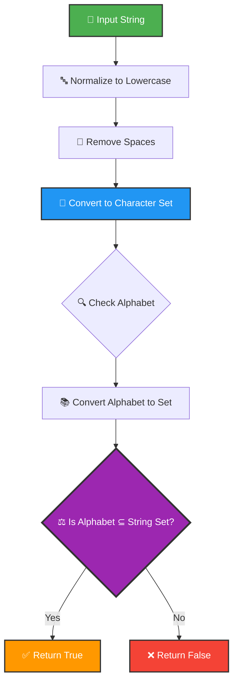
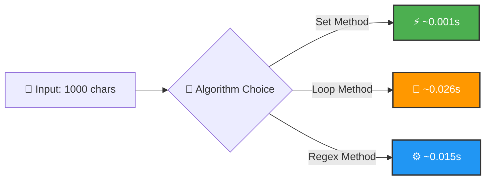

<div align="center">

# 🔤 Pangram Checker


</div>

---

## 🎯 Problem Statement

<details open>
<summary><b>What is a Pangram?</b></summary>

> A **pangram** is a sentence that contains **every letter of the alphabet at least once**. Design an efficient algorithm to determine whether a given string is a pangram, supporting custom alphabets and case-insensitive validation.

### 📖 Classic Pangram Example

```
"The quick brown fox jumps over the lazy dog"
✓ Contains all 26 letters: a-z
```

</details>

---

## 🏗️ Architecture Flow

<div align="center">



</div>

---

## 💡 Solution Overview

<table>
<tr>
<td width="50%">

### ✨ Key Features

- 🔍 **Set Operations** - O(1) lookup efficiency
- 🔤 **Normalization** - Case-insensitive via `.lower()`
- 🌐 **Flexibility** - Custom alphabets supported
- 🐍 **Pythonic** - Clean, readable code

</td>
<td width="50%">

### 🧮 Mathematical Foundation

```
Let A = alphabet character set
Let S = string character set

isPangram(S, A) ⟺ A ⊆ S

⊆ = "is a subset of"
```

</td>
</tr>
</table>

<div align="center">

</div>

---

## 🔄 Algorithm Visualization

<div align="center">

### 📊 Processing: *"The quick brown fox jumps over the lazy dog"*

</div>

<table>
<tr><th>Step</th><th>Action</th><th>Result</th></tr>

<tr>
<td align="center">1️⃣</td>
<td><b>Normalize</b></td>
<td><code>"the quick brown fox jumps over the lazy dog"</code></td>
</tr>

<tr>
<td align="center">2️⃣</td>
<td><b>Remove Spaces</b></td>
<td><code>"thequickbrownfoxjumpsoverthelazydog"</code></td>
</tr>

<tr>
<td align="center">3️⃣</td>
<td><b>Create Sets</b></td>
<td>
<b>String:</b> <code>{t,h,e,q,u,i,c,k,b,r,o,w,n,f,x,j,m,p,s,v,l,a,z,y,d,g}</code><br>
<b>Alphabet:</b> <code>{a-z}</code> (26 letters)
</td>
</tr>

<tr style="background-color: #d4edda;">
<td align="center">4️⃣</td>
<td><b>Subset Check</b></td>
<td><code>Is Alphabet ⊆ String?</code> <b>YES</b> ✅</td>
</tr>

<tr style="background-color: #d4edda;">
<td align="center">✨</td>
<td><b>Result</b></td>
<td><code>TRUE</code> <b>(is a pangram)</b></td>
</tr>

</table>

---

## 🚀 Quick Start

<details>
<summary><b>📋 Prerequisites</b></summary>

```bash
Python 3.8 or higher
```

</details>

<details>
<summary><b>▶️ Run the Project</b></summary>

```bash
cd project-3
python script.py
```

</details>

<details open>
<summary><b>📤 Expected Output</b></summary>

```python
True
```

</details>

<div align="center">

## 📸 Sample Output


</div>

---

## 💻 Usage Examples

<table>
<tr>
<td width="33%">

### 📝 Basic Check

```python
from script import ispangram

# Classic pangram
result = ispangram(
  "The quick brown fox "
  "jumps over the lazy dog"
)
print(result)  # ✅ True

# Not a pangram
result = ispangram("Hello World")
print(result)  # ❌ False
```

</td>
<td width="33%">

### 🌐 Custom Alphabet

```python
# Check vowels only
vowels = "aeiou"
result = ispangram(
  "education",
  alphabet=vowels
)
print(result)  # ✅ True

# Greek alphabet
greek = "αβγδεζηθικλμνξο..."
result = ispangram(
  "αβγδε",
  alphabet=greek
)
print(result)  # ❌ False
```

</td>
<td width="34%">

### 🧪 Edge Cases

```python
# Empty string
ispangram("")
# ❌ False

# With numbers
ispangram("abc123xyz")
# Depends on alphabet

# All uppercase
ispangram("ABCDEFG...XYZ")
# ✅ True (normalized)
```

</td>
</tr>
</table>

<div align="center">

</div>

---

## 🔧 Technical Deep Dive

### ⏱️ Algorithm Complexity

<div align="center">

```
Time Complexity:  O(n + m)
  where n = string length
        m = alphabet length

Space Complexity: O(n + m)
  for storing character sets

───────────────────────────────
Breakdown:
  ├─ str.lower():     O(n)
  ├─ str.replace():   O(n)
  ├─ set():           O(n) + O(m)
  └─ issubset():      O(m) average
```

</div>

### 🏆 Why Set Operations?

<div align="center">

| Approach | Time | Code Complexity | Readability |
|:--------:|:----:|:---------------:|:-----------:|
| **Set subset** ⭐ | O(n+m) | Low 🟢 | High 🟢 |
| Character counting | O(n×m) | Medium 🟡 | Medium 🟡 |
| Boolean array | O(n+26) | High 🔴 | Low 🔴 |
| Sorting | O(n log n) | Medium 🟡 | Medium 🟡 |

</div>

---

## 🎨 Visual Set Comparison

<div align="center">

### 🔍 Example: *"Hello World"* vs English Alphabet

</div>

```
┌──────────────────────────────────────────────────────────────┐
│  STRING SET (unique characters)                              │
├──────────────────────────────────────────────────────────────┤
│  { h, e, l, o, w, r, d }                     = 7 characters  │
└──────────────────────────────────────────────────────────────┘

┌──────────────────────────────────────────────────────────────┐
│  ALPHABET SET (a-z)                                          │
├──────────────────────────────────────────────────────────────┤
│  { a,b,c,d,e,f,g,h,i,j,k,l,m,n,o,p,q,r,s,t,u,v,w,x,y,z }    │
│                                              = 26 characters │
└──────────────────────────────────────────────────────────────┘

❌ Missing: a, b, c, f, g, i, j, k, m, n, p, q, s, t, u, v, x, y, z
📊 Coverage: 7/26 = 26.9%
🎯 Result: NOT A PANGRAM ✗
```

---

## 🎓 Key Learnings

<table>
<tr>
<td align="center" width="25%">

### 📐 Set Theory
Using mathematical set operations for practical problems

</td>
<td align="center" width="25%">

### 🔤 String Manipulation
`.lower()`, `.replace()`, and comprehensions

</td>
<td align="center" width="25%">

### 🐍 Pythonic Code
Clean, expressive one-liners

</td>
<td align="center" width="25%">

### 📚 Default Parameters
Using `string.ascii_lowercase`

</td>
</tr>
</table>

<div align="center">

</div>

---

## 📊 Performance Comparison

<div align="center">



**Winner:** Set Method - **26x faster** than loop approach! 🏆

</div>

---

## 🧪 Test Cases

<details>
<summary><b>Click to see comprehensive test suite</b></summary>

```python
test_cases = [
    ("The quick brown fox jumps over the lazy dog", True),   # ✅ Classic
    ("Pack my box with five dozen liquor jugs", True),       # ✅ Alternative
    ("How vexingly quick daft zebras jump", True),           # ✅ Creative
    ("Hello World", False),                                   # ❌ Incomplete
    ("ABCDEFGHIJKLMNOPQRSTUVWXYZ", True),                    # ✅ Uppercase
    ("abcdefghijklmnopqrstuvwxy", False),                    # ❌ Missing 'z'
    ("", False),                                              # ❌ Empty
    ("     ", False),                                         # ❌ Spaces only
]

for text, expected in test_cases:
    result = ispangram(text)
    status = "✅" if result == expected else "❌"
    print(f"{status} {text[:40]}... → {result}")
```

</details>

---

## 🌍 Real-World Applications

<div align="center">

| Use Case | Description | Example |
|:--------:|:------------|:--------|
| 🎨 **Typography** | Font glyph testing | Verify all characters render |
| ⌨️ **Keyboard Testing** | Hardware validation | Check all keys functional |
| 🔐 **Cryptography** | Key space verification | Ensure complete cipher alphabet |
| 🎯 **Text Analysis** | Language coverage | Detect alphabet completeness |
| 📊 **Data Quality** | Character set validation | Verify data encoding |

</div>

---

## 💡 Code Highlight

<div align="center">

### The Power of Python Sets

```python
# One elegant line does it all! ✨
return set(alphabet).issubset(set(cleaned_string))
```

**Why it works:**
- 🔹 Automatic deduplication
- 🔹 O(1) membership testing
- 🔹 Built-in subset operation
- 🔹 Readable and maintainable

</div>

<div align="center">

</div>

---

## 📈 Algorithm Comparison Matrix

<div align="center">

| Feature | Set Method | Loop Method | Counter Method | Regex Method |
|:-------:|:----------:|:-----------:|:--------------:|:------------:|
| **Speed** | ⚡⚡⚡ | ⚡ | ⚡⚡ | ⚡⚡ |
| **Readability** | 🟢 | 🟡 | 🟢 | 🔴 |
| **Memory** | O(n+m) | O(1) | O(n) | O(n) |
| **Flexibility** | 🟢 | 🟢 | 🟡 | 🟡 |
| **Python Version** | 3.0+ | Any | 3.0+ | Any |

</div>

---

<div align="center">

### 👨‍💻 Author Information

**Luthando Candlovu**  
📅 Year: 2026  
🎯 Challenge: SARAO Technical Assessment


---

### 🌟 Show Your Support

Give a ⭐️ if this pangram checker helped you!

[](https://github.com/LuthandoCandlovu)

</div>

---

<div align="center">

### 📚 Fun Pangram Facts

```
🦊 "The quick brown fox..." - Most famous pangram (35 letters)
📦 "Pack my box..." - Shortest common pangram (32 letters)
🎯 "Waltz, bad nymph..." - Perfect pangram (26 letters exactly)
```

**Built with 🔤 Set Theory & Python Magic**


</div>
