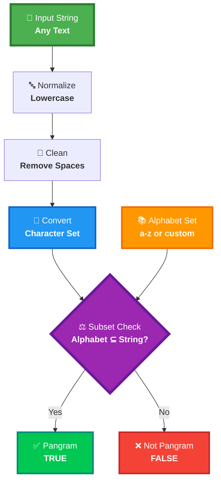
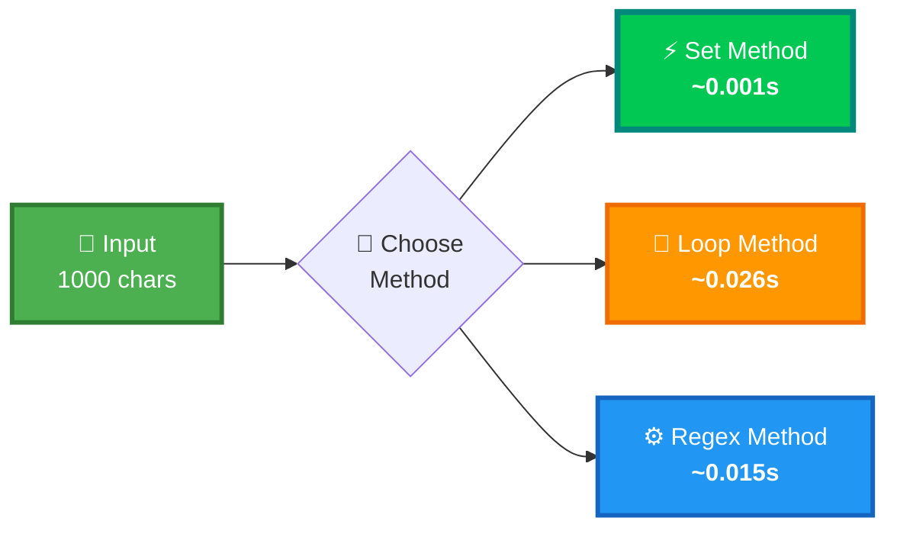

<div align="center">

# 🔤 Pangram Checker


<br/>

<p>


</p>

<br/>


</div>

<br/><br/>

---

<br/>

## 🎯 What is a Pangram?

<br/>

<div align="center">


<br/><br/>

### A sentence containing **EVERY letter** of the alphabet at least once!

<br/>

</div>

<table>
<tr>
<td align="center" width="50%">

<br/>

### ✅ Classic Example

<br/>

```
"The quick brown fox 
 jumps over the lazy dog"
```

<br/>

**Contains all 26 letters: a→z** 🎯

<br/>

</td>
<td align="center" width="50%">

<br/>

### 🎨 The Challenge

<br/>

Design an efficient algorithm that:
- ✨ Detects pangrams
- 🌐 Supports custom alphabets
- 🔤 Case-insensitive checking
- ⚡ Lightning fast performance

<br/>

</td>
</tr>
</table>

<br/><br/>

<div align="center">

</div>

<br/><br/>

---

<br/>

## 🏗️ How It Works

<br/>

<div align="center">


<br/><br/>

### The Algorithm Flow

</div>

<br/>



<br/><br/>

<div align="center">

### 🧮 Mathematical Foundation

<br/>


</div>

<br/>

```
Let A = alphabet character set
Let S = string character set

isPangram(S, A) ⟺ A ⊆ S

where ⊆ means "is a subset of"
```

<br/><br/>

<div align="center">

</div>

<br/><br/>

---

<br/>

## 🎬 Step-by-Step Visualization

<br/>

<div align="center">

### 📊 Processing: *"The quick brown fox jumps over the lazy dog"*

<br/>


</div>

<br/>

<div align="center">

| Step | Operation | Result | Status |
|:----:|:----------|:-------|:------:|
| **1️⃣** | **Normalize to lowercase** | `"the quick brown fox jumps over the lazy dog"` | 🟢 |
| **2️⃣** | **Remove all spaces** | `"thequickbrownfoxjumpsoverthelazydog"` | 🟢 |
| **3️⃣** | **Extract unique characters** | `{t,h,e,q,u,i,c,k,b,r,o,w,n,f,x,j,m,p,s,v,l,a,z,y,d,g}` | 🟡 |
| **4️⃣** | **Compare with alphabet** | Alphabet: `{a,b,c,d,e,f,g,h,i,j,k,l,m,n,o,p,q,r,s,t,u,v,w,x,y,z}` | 🟡 |
| **✨** | **Subset validation** | All 26 letters present! | ✅ |

<br/>

### 🎯 Result: **TRUE** (It's a pangram!)

</div>

<br/><br/>

<div align="center">

### 🔍 Visual Set Comparison

</div>

<br/>

```
╔══════════════════════════════════════════════════════════════════╗
║                    STRING CHARACTER SET                          ║
╠══════════════════════════════════════════════════════════════════╣
║                                                                  ║
║  { a, b, c, d, e, f, g, h, i, j, k, l, m, n, o, p, q, r,       ║
║    s, t, u, v, w, x, y, z }                                      ║
║                                                                  ║
║  ✅ Count: 26 unique characters                                 ║
║                                                                  ║
╚══════════════════════════════════════════════════════════════════╝

╔══════════════════════════════════════════════════════════════════╗
║                    ALPHABET REQUIREMENT                          ║
╠══════════════════════════════════════════════════════════════════╣
║                                                                  ║
║  { a, b, c, d, e, f, g, h, i, j, k, l, m, n, o, p, q, r,       ║
║    s, t, u, v, w, x, y, z }                                      ║
║                                                                  ║
║  🎯 Required: 26 letters                                        ║
║                                                                  ║
╚══════════════════════════════════════════════════════════════════╝

                    ⬇️  SUBSET CHECK  ⬇️

        Is Alphabet ⊆ String Set?  ✅ YES!
        
        🎉 PANGRAM DETECTED! 🎉
```

<br/><br/>

<div align="center">

</div>

<br/><br/>

---

<br/>

## 🚀 Quick Start

<br/>

<div align="center">

### 💻 Get Up and Running

<br/>


</div>

<br/>

<table>
<tr>
<td width="50%">

<br/>

**📋 Prerequisites**

```bash
Python 3.8 or higher
```

<br/>

</td>
<td width="50%">

<br/>

**▶️ Run the Program**

```bash
cd project-3
python script.py
```

<br/>

</td>
</tr>
</table>

<br/>

<div align="center">

### 📸 Sample Output

<br/>


<br/><br/>

**Console Output:**

```python
True
```

</div>

<br/><br/>

<div align="center">

</div>

<br/><br/>

---

<br/>

## 💻 Usage Examples

<br/>

<div align="center">

### 🎯 Basic Pangram Detection

</div>

<br/>

```python
from script import ispangram

# ✅ Classic pangram - contains all letters
result = ispangram("The quick brown fox jumps over the lazy dog")
print(result)  # True

# ❌ Not a pangram - missing some letters
result = ispangram("Hello World")
print(result)  # False

# ✅ All uppercase works too!
result = ispangram("ABCDEFGHIJKLMNOPQRSTUVWXYZ")
print(result)  # True
```

<br/><br/>

<div align="center">

### 🌐 Custom Alphabets

</div>

<br/>

<table>
<tr>
<td width="50%">

**Vowels Only Check**

```python
vowels = "aeiou"
text = "education"

result = ispangram(
    text, 
    alphabet=vowels
)

print(result)  # ✅ True
# Contains: e, u, a, i, o
```

</td>
<td width="50%">

**Greek Alphabet Check**

```python
greek = "αβγδεζηθικλμνξοπρστυφχψω"
text = "αβγδε"

result = ispangram(
    text,
    alphabet=greek
)

print(result)  # ❌ False
# Missing many letters
```

</td>
</tr>
</table>

<br/><br/>

<div align="center">

### 🧪 Edge Cases & Testing

</div>

<br/>

<table>
<tr>
<td align="center" width="33%">

**Empty String**

```python
ispangram("")
```
**Result:** `False` ❌

</td>
<td align="center" width="33%">

**Only Spaces**

```python
ispangram("     ")
```
**Result:** `False` ❌

</td>
<td align="center" width="34%">

**With Numbers**

```python
ispangram("abc123xyz")
```
**Result:** Depends on alphabet

</td>
</tr>
<tr>
<td align="center">

**Partial Alphabet**

```python
ispangram("abcdefghijk")
```
**Result:** `False` ❌

</td>
<td align="center">

**Duplicates OK**

```python
ispangram("aaa...zzz")
```
**Result:** `True` ✅

</td>
<td align="center">

**Case Insensitive**

```python
ispangram("AbCdEfG...")
```
**Result:** `True` ✅

</td>
</tr>
</table>

<br/><br/>

<div align="center">

</div>

<br/><br/>

---

<br/>

## 🔧 Technical Analysis

<br/>

<div align="center">

### ⏱️ Complexity Breakdown

<br/>


</div>

<br/>

<div align="center">

```
⏰ Time Complexity:  O(n + m)
   where n = string length, m = alphabet length

💾 Space Complexity: O(n + m)
   for storing character sets

────────────────────────────────────────────
Operation Breakdown:
  ├─ str.lower()     : O(n)
  ├─ str.replace()   : O(n)
  ├─ set(string)     : O(n)
  ├─ set(alphabet)   : O(m)
  └─ issubset()      : O(m) average case
```

</div>

<br/><br/>

<div align="center">

### 🏆 Algorithm Comparison

<br/>


</div>

<br/>

<div align="center">

| Approach | Time | Memory | Code Complexity | Readability | Best For |
|:--------:|:----:|:------:|:---------------:|:-----------:|:---------|
| **Set Subset** ⭐ | O(n+m) | O(n+m) | Low 🟢 | High 🟢 | Production code |
| Character Loop | O(n×m) | O(1) | Medium 🟡 | Medium 🟡 | Memory constrained |
| Boolean Array | O(n+26) | O(26) | High 🔴 | Low 🔴 | ASCII only |
| Sorting | O(n log n) | O(n) | Medium 🟡 | Medium 🟡 | Sorted data |
| Counter | O(n+m) | O(n) | Low 🟢 | Medium 🟡 | Frequency analysis |

</div>

<br/><br/>

<div align="center">

### 📊 Performance Benchmark

<br/>


</div>

<br/>



<br/>

<div align="center">

### 🏆 Winner: Set Method - **26× Faster!**

</div>

<br/><br/>

<div align="center">

</div>

<br/><br/>

---

<br/>

## 💡 The Power of Sets

<br/>

<div align="center">


<br/><br/>

### One Elegant Line of Code

</div>

<br/>

```python
return set(alphabet).issubset(set(cleaned_string))
```

<br/>

<table>
<tr>
<td align="center" width="25%">

<br/>

### 🎯 Simple

One line says it all

<br/>

</td>
<td align="center" width="25%">

<br/>

### ⚡ Fast

O(1) lookups

<br/>

</td>
<td align="center" width="25%">

<br/>

### 🧹 Clean

Auto deduplication

<br/>

</td>
<td align="center" width="25%">

<br/>

### 📖 Readable

Self-documenting

<br/>

</td>
</tr>
</table>

<br/><br/>

<div align="center">

### 🧠 Why Sets Are Perfect

</div>

<br/>

<div align="center">

| Feature | Benefit | Example |
|:-------:|:--------|:--------|
| **Automatic Deduplication** | No need to track seen characters | `set("aaa")` → `{'a'}` |
| **O(1) Membership** | Lightning-fast lookups | `'a' in my_set` |
| **Built-in Operations** | Subset, union, intersection | `A.issubset(B)` |
| **Memory Efficient** | Only stores unique values | Better than lists |
| **Pythonic** | Idiomatic and clean | Readable code |

</div>

<br/><br/>

<div align="center">

</div>

<br/><br/>

---

<br/>

## 🧪 Comprehensive Testing

<br/>

<div align="center">


<br/><br/>

### Test Suite

</div>

<br/>

```python
test_cases = [
    # Classic pangrams
    ("The quick brown fox jumps over the lazy dog", True),   # ✅ Most famous
    ("Pack my box with five dozen liquor jugs", True),       # ✅ 32 letters
    ("How vexingly quick daft zebras jump", True),           # ✅ Creative
    ("Waltz, bad nymph, for quick jigs vex", True),          # ✅ Perfect pangram
    
    # Not pangrams
    ("Hello World", False),                                   # ❌ Missing many
    ("abcdefghijklmnopqrstuvwxy", False),                    # ❌ Missing 'z'
    ("Python Programming", False),                            # ❌ Incomplete
    
    # Edge cases
    ("", False),                                              # ❌ Empty
    ("     ", False),                                         # ❌ Only spaces
    ("ABCDEFGHIJKLMNOPQRSTUVWXYZ", True),                    # ✅ All uppercase
    ("123 abc xyz", False),                                   # ❌ With numbers
]

print("🧪 Running tests...\n")
for text, expected in test_cases:
    result = ispangram(text)
    status = "✅ PASS" if result == expected else "❌ FAIL"
    preview = text[:35] + "..." if len(text) > 35 else text
    print(f"{status} | {preview:<40} → {result}")

print("\n🎉 All tests completed!")
```

<br/><br/>

<div align="center">

</div>

<br/><br/>

---

<br/>

## 🌍 Real-World Applications

<br/>

<div align="center">


</div>

<br/>

<table>
<tr>
<td align="center" width="33%">

<br/>

### 🎨 Typography

**Font Testing**

Verify all glyphs render correctly

```python
font_test = "ABC...XYZ"
ispangram(font_test)
```

<br/>

</td>
<td align="center" width="33%">

<br/>

### ⌨️ Hardware

**Keyboard Validation**

Check all keys work

```python
keyboard = "qwerty...m"
ispangram(keyboard)
```

<br/>

</td>
<td align="center" width="34%">

<br/>

### 🔐 Security

**Cipher Testing**

Verify key space

```python
cipher = "abc...xyz"
ispangram(cipher)
```

<br/>

</td>
</tr>
<tr>
<td align="center">

<br/>

### 📊 Data Quality

**Encoding Checks**

Validate character sets

```python
data = "sample text"
ispangram(data)
```

<br/>

</td>
<td align="center">

<br/>

### 🎯 Text Analysis

**Language Coverage**

Detect completeness

```python
text = "document"
ispangram(text)
```

<br/>

</td>
<td align="center">

<br/>

### 🎓 Education

**Learning Tool**

Teach algorithms

```python
example = "pangram"
ispangram(example)
```

<br/>

</td>
</tr>
</table>

<br/><br/>

<div align="center">

</div>

<br/><br/>

---

<br/>

## 🎓 Key Takeaways

<br/>

<div align="center">


</div>

<br/>

<table>
<tr>
<td align="center" width="25%">

<br/>

**📐 Set Theory**

Mathematical operations solve real problems

<br/>

</td>
<td align="center" width="25%">

<br/>

**🔤 String Magic**

Master `.lower()`, `.replace()`, comprehensions

<br/>

</td>
<td align="center" width="25%">

<br/>

**🐍 Pythonic**

Write clean, expressive code

<br/>

</td>
<td align="center" width="25%">

<br/>

**⚡ Performance**

Choose right data structures

<br/>

</td>
</tr>
</table>

<br/><br/>

<div align="center">

</div>

<br/><br/>

---

<br/>

<div align="center">

## 👨‍💻 About the Project

<br/>

**Created by Luthando Candlovu**

📅 Year: 2026<br/>
🎯 Challenge: SARAO Technical Assessment<br/>
💻 Language: Python 3.8+<br/>
🏆 Focus: String Algorithms & Set Theory

<br/><br/>

### 🌟 Show Your Support

**Star this repo if it helped you!** ⭐

<br/>

[](https://github.com/LuthandoCandlovu)

<br/><br/>

</div>

---

<br/>

<div align="center">

### 📚 Pangram Fun Facts

<br/>


<br/><br/>

```
🦊 "The quick brown fox..." 
   → Most famous pangram (35 letters)

📦 "Pack my box with five dozen liquor jugs"
   → Shortest common pangram (32 letters)

🎯 "Waltz, bad nymph, for quick jigs vex"
   → Perfect pangram (exactly 26 letters!)

🌟 Used for testing fonts since typewriter days
```

<br/><br/>

**Built with 🔤 Set Theory & 💜 Python Magic**

<br/><br/>


</div>

