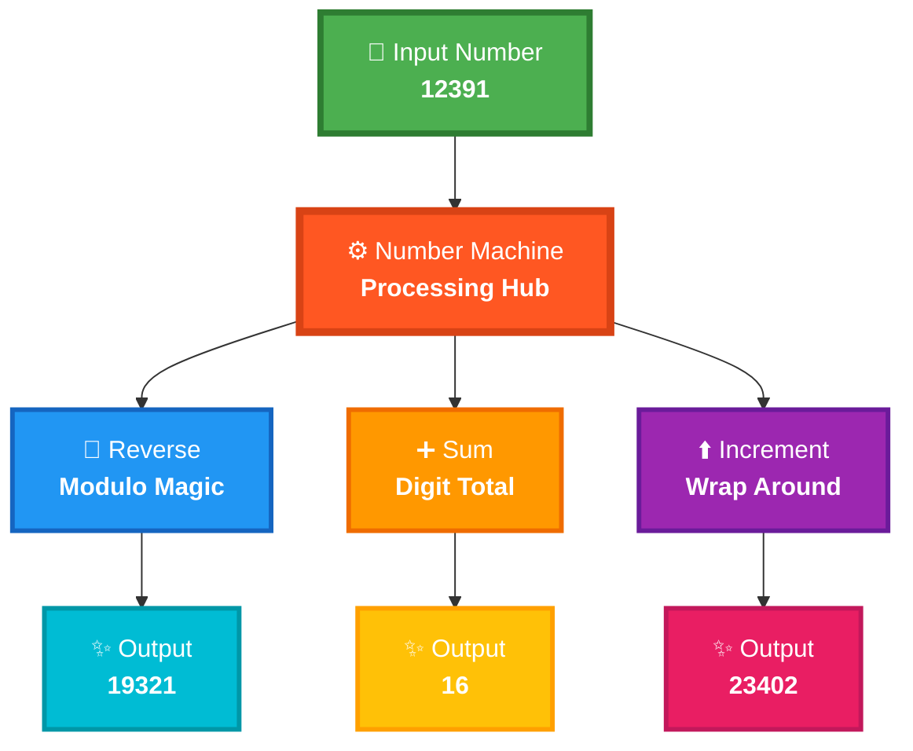

<div align="center">

# 🔢 Number Machine


<br/>

<p>


</p>

<br/>


</div>

<br/><br/>

---

<br/>

## 🎯 The Challenge

<br/>

<div align="center">

### ✨ Build a number manipulation system with **ZERO built-in reverse functions** ✨

<br/>


</div>

<br/>

<table>
<tr>
<td align="center" width="33%">


<br/><br/>

### 🔄 Reverse Number

**Flip the digits backwards**

Using pure mathematics

<br/>

`12391 → 19321`

</td>
<td align="center" width="33%">


<br/><br/>

### ➕ Sum Digits

**Add all digits together**

Calculate the total

<br/>

`1+2+3+9+1 = 16`

</td>
<td align="center" width="34%">


<br/><br/>

### ⬆️ Increment Each

**Add 1 with wrap-around**

9 becomes 0

<br/>

`12391 → 23402`

</td>
</tr>
</table>

<br/><br/>

<div align="center">

### 💫 Watch The Magic Happen

<br/>


</div>

<br/>

```diff
🎯 Input Number: 12391

+ 🔄 Reverse Operation:   12391 → 19321 ✨
+ ➕ Sum Operation:       1 + 2 + 3 + 9 + 1 = 16 ✨
+ ⬆️ Increment Operation: [1→2] [2→3] [3→4] [9→0] [1→2] = 23402 ✨
```

<br/><br/>

---

<br/>

## 🏗️ System Architecture

<br/>

<div align="center">



</div>

<br/><br/>

<div align="center">

</div>

<br/><br/>

---

<br/>

## 🔄 Algorithm Breakdown

<br/>

<div align="center">

### 🎬 Step-by-Step Reverse Animation

<br/>


</div>

<br/>

<div align="center">

| Step | Current `n` | Extract Digit<br/>`n % 10` | Build Reversed<br/>`rev × 10 + digit` | Remove Digit<br/>`n // 10` | Status |
|:----:|:-----------:|:-------------------------:|:-------------------------------------:|:--------------------------:|:------:|
| 1️⃣ | `12391` | `1` | `0 × 10 + 1 = 1` | `1239` | 🟢 |
| 2️⃣ | `1239` | `9` | `1 × 10 + 9 = 19` | `123` | 🟢 |
| 3️⃣ | `123` | `3` | `19 × 10 + 3 = 193` | `12` | 🟡 |
| 4️⃣ | `12` | `2` | `193 × 10 + 2 = 1932` | `1` | 🟠 |
| 5️⃣ | `1` | `1` | `1932 × 10 + 1 = 19321` | `0` | 🔴 |
| ✅ | **DONE** | — | **`19321`** | — | ✨ |

</div>

<br/><br/>

<div align="center">

### ➕ Sum of Digits Visualization

<br/>


</div>

<br/>

```
╔════════════════════════════════════════════════════════════════╗
║                     NUMBER: 12391                              ║
╠════════════════════════════════════════════════════════════════╣
║                                                                ║
║   Convert to String: "12391"                                   ║
║                                                                ║
║   Extract Each Digit:                                          ║
║      ┌─────┬─────┬─────┬─────┬─────┐                          ║
║      │  1  │  2  │  3  │  9  │  1  │                          ║
║      └─────┴─────┴─────┴─────┴─────┘                          ║
║                                                                ║
║   Calculate Sum:                                               ║
║      1 + 2 + 3 + 9 + 1 = 16  ✨                               ║
║                                                                ║
╚════════════════════════════════════════════════════════════════╝
```

<br/><br/>

<div align="center">

### ⬆️ Increment with Wrap-Around

<br/>


</div>

<br/>

<div align="center">

| Original | Operation | Result | Effect |
|:--------:|:---------:|:------:|:------:|
| `1` | `(1 + 1) % 10` | `2` | ✅ Normal |
| `2` | `(2 + 1) % 10` | `3` | ✅ Normal |
| `3` | `(3 + 1) % 10` | `4` | ✅ Normal |
| `9` | `(9 + 1) % 10` | `0` | 🔄 **WRAP!** |
| `1` | `(1 + 1) % 10` | `2` | ✅ Normal |

<br/>

### ✨ Final Result: `23402`

</div>

<br/><br/>

<div align="center">

</div>

<br/><br/>

---

<br/>

## 🚀 Quick Start

<br/>

<div align="center">

### 📦 Installation & Running

</div>

<br/>

<table>
<tr>
<td width="50%">

**📋 Prerequisites**

```bash
Python 3.8+
```

</td>
<td width="50%">

**▶️ Execute**

```bash
cd project-4
python script.py
```

</td>
</tr>
</table>

<br/>

<div align="center">

### 📸 Sample Output

<br/>


</div>

<br/>

<div align="center">

**Expected Console Output:**

```python
Reversed: 19321
Digit sum: 16
Incremented: 23402
```

</div>

<br/><br/>

<div align="center">

</div>

<br/><br/>

---

<br/>

## 💻 Code Examples

<br/>

<div align="center">

### 🎯 Basic Usage

</div>

<br/>

```python
from script import NumberMachine

# Create instance with your number
nm = NumberMachine(12391)

# Perform operations
print(f"🔄 Reversed: {nm.reverse_number()}")      # Output: 19321
print(f"➕ Sum: {nm.sum_of_digits()}")            # Output: 16
print(f"⬆️ Incremented: {nm.increment_digits()}")  # Output: 23402
```

<br/><br/>

<div align="center">

### 🧪 Edge Cases

</div>

<br/>

<table>
<tr>
<td width="50%">

**Single Digit**

```python
nm = NumberMachine(7)

nm.reverse_number()    # 7
nm.sum_of_digits()     # 7
nm.increment_digits()  # 8
```

</td>
<td width="50%">

**Trailing Zeros**

```python
nm = NumberMachine(1200)

nm.reverse_number()    # 21
nm.increment_digits()  # 2311
```

</td>
</tr>
<tr>
<td width="50%">

**All Nines (Wrap Test)**

```python
nm = NumberMachine(999)

nm.increment_digits()  # 0
# All digits wrap!
```

</td>
<td width="50%">

**Large Numbers**

```python
nm = NumberMachine(987654321)

nm.reverse_number()    # 123456789
nm.sum_of_digits()     # 45
```

</td>
</tr>
</table>

<br/><br/>

<div align="center">

</div>

<br/><br/>

---

<br/>

## 🧠 The Mathematics Behind It

<br/>

<div align="center">

### 🔍 Understanding Modulo (`%`)

<br/>


</div>

<br/>

<div align="center">

The modulo operator **extracts the rightmost digit**:

</div>

<br/>

```python
12391 % 10 = 1  ← Rightmost digit
1239 % 10  = 9  ← Next digit
123 % 10   = 3  ← Next digit
12 % 10    = 2  ← Next digit
1 % 10     = 1  ← Last digit
```

<br/><br/>

<div align="center">

### ➗ Understanding Integer Division (`//`)

<br/>


</div>

<br/>

<div align="center">

Integer division **removes the rightmost digit**:

</div>

<br/>

```python
12391 // 10 = 1239  ← Removed 1
1239 // 10  = 123   ← Removed 9
123 // 10   = 12    ← Removed 3
12 // 10    = 1     ← Removed 2
1 // 10     = 0     ← Removed 1, DONE! ✅
```

<br/><br/>

<div align="center">

### 🔄 Understanding Wrap-Around

<br/>


</div>

<br/>

<div align="center">

Modulo 10 creates **cyclic behavior**:

</div>

<br/>

```python
(0 + 1) % 10 = 1
(1 + 1) % 10 = 2
(2 + 1) % 10 = 3
   ...
(8 + 1) % 10 = 9
(9 + 1) % 10 = 0  ← Wraps back to 0! 🔄
```

<br/><br/>

<div align="center">

</div>

<br/><br/>

---

<br/>

## ⏱️ Performance Analysis

<br/>

<div align="center">

### 📊 Time & Space Complexity

<br/>


</div>

<br/>

<div align="center">

| Operation | Time Complexity | Space Complexity | Method |
|:---------:|:---------------:|:----------------:|:-------|
| 🔄 **Reverse** | `O(d)` | `O(1)` | Pure integer arithmetic |
| ➕ **Sum** | `O(d)` | `O(d)` | String conversion |
| ⬆️ **Increment** | `O(d)` | `O(d)` | String iteration |

<br/>

**where `d` = number of digits**

</div>

<br/><br/>

<div align="center">

### 🎯 Why This Approach?

</div>

<br/>

<table>
<tr>
<td align="center" width="33%">

**🎨 Clean Code**

Easy to read<br/>
Easy to maintain<br/>
Pythonic style

</td>
<td align="center" width="33%">

**⚡ Efficient**

Linear time<br/>
Minimal space<br/>
Fast execution

</td>
<td align="center" width="34%">

**🧠 Educational**

Learn modulo<br/>
Learn division<br/>
Learn algorithms

</td>
</tr>
</table>

<br/><br/>

<div align="center">

</div>

<br/><br/>

---

<br/>

## 🧪 Test Suite

<br/>

<div align="center">

### ✅ Comprehensive Testing

<br/>


</div>

<br/>

```python
def test_number_machine():
    """Complete test coverage for all operations"""
    
    # ✅ Test 1: Main Example
    nm = NumberMachine(12391)
    assert nm.reverse_number() == 19321
    assert nm.sum_of_digits() == 16
    assert nm.increment_digits() == 23402
    print("✅ Main example test passed!")
    
    # ✅ Test 2: Palindrome Number
    nm = NumberMachine(12321)
    assert nm.reverse_number() == 12321
    print("✅ Palindrome test passed!")
    
    # ✅ Test 3: All Nines (Wrap-Around)
    nm = NumberMachine(999)
    assert nm.increment_digits() == 0
    print("✅ Wrap-around test passed!")
    
    # ✅ Test 4: Single Digit
    nm = NumberMachine(5)
    assert nm.reverse_number() == 5
    assert nm.sum_of_digits() == 5
    assert nm.increment_digits() == 6
    print("✅ Single digit test passed!")
    
    # ✅ Test 5: Trailing Zeros
    nm = NumberMachine(1000)
    assert nm.reverse_number() == 1
    assert nm.increment_digits() == 2111
    print("✅ Trailing zeros test passed!")
    
    # ✅ Test 6: Large Numbers
    nm = NumberMachine(987654321)
    assert nm.reverse_number() == 123456789
    assert nm.sum_of_digits() == 45
    print("✅ Large number test passed!")
    
    print("\n🎉 All tests passed successfully! 🎉")

# Run tests
test_number_machine()
```

<br/><br/>

<div align="center">

</div>

<br/><br/>

---

<br/>

## 💬 Interview Questions

<br/>

<div align="center">


<div align="center">

</div>

<br/><br/>

---

<br/>

<div align="center">

## 👨‍💻 About

<br/>


<br/><br/>

**Created by Luthando Candlovu**

📅 Year: 2026<br/>
🎯 Challenge: SARAO Technical Assessment<br/>
💻 Language: Python 3.8+

<br/>


<br/><br/>

### 🌟 Show Your Support

**Give a ⭐️ if this project helped you!**

<br/>

[](https://github.com/LuthandoCandlovu)

<br/><br/>

</div>

---

<br/>

<div align="center">

### 🎲 Fun Number Facts

<br/>

```
🔢 12391 is a composite number (13 × 953)
✨ 19321 is a prime number!
➕ Digital root of 12391 = 7
🔄 Reversing twice returns original (identity property)
```

<br/><br/>

**Crafted with 🔢 Mathematics & ❤️ Python**

<br/><br/>


</div>
