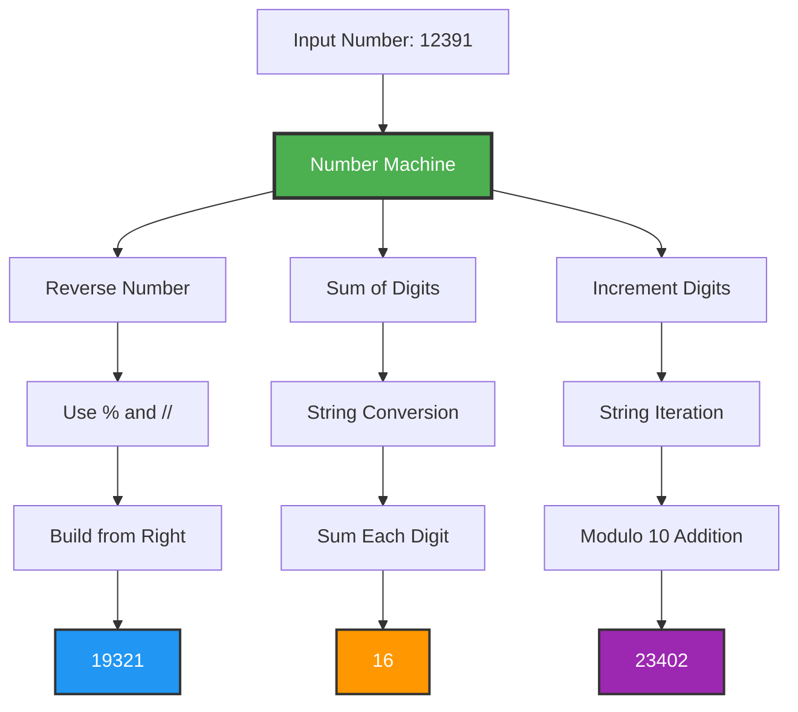
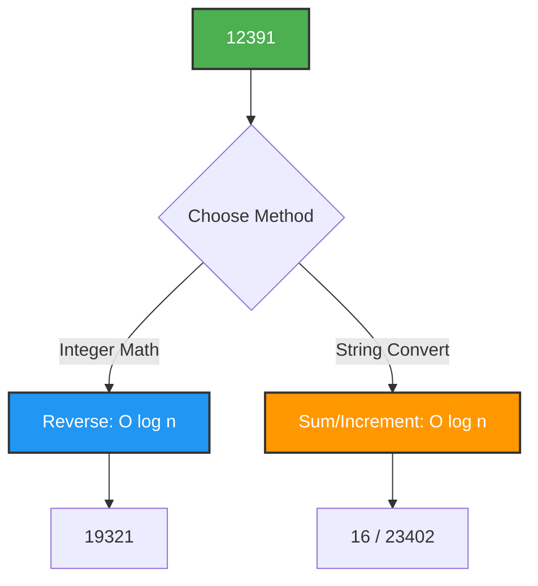

# 🔢 Number Machine


## 🎯 Problem Statement

Create a number manipulation system that performs three distinct operations on integers **WITHOUT using built-in reverse functions**:

1. **Reverse Number**: Reverse digit order using modulus arithmetic
2. **Sum of Digits**: Calculate total of all digits
3. **Increment Digits**: Add 1 to each digit with wrap-around (9→0)

### Example

```
Input: 12391

Operations:
  Reverse:   19321
  Sum:       1+2+3+9+1 = 16
  Increment: 23402 (1→2, 2→3, 3→4, 9→0, 1→2)
```

## 🏗️ Architecture



## 💡 Solution Overview

This implementation showcases **three distinct algorithmic approaches**:

### 1. **Reverse Number** - Pure Integer Arithmetic

Uses modulus operator (`%`) and integer division (`//`) to extract and reconstruct digits

### 2. **Sum of Digits** - String Conversion

Leverages Python's string iteration for clean summation

### 3. **Increment Digits** - Modular Arithmetic

Applies modulo 10 for automatic wrap-around behavior

## 🔄 Algorithm Visualizations

### Reverse Number Algorithm

```
Number: 12391

Iteration 1:
  n = 12391
  digit = 12391 % 10 = 1
  reversed = 0 × 10 + 1 = 1
  n = 12391 // 10 = 1239

Iteration 2:
  n = 1239
  digit = 1239 % 10 = 9
  reversed = 1 × 10 + 9 = 19
  n = 1239 // 10 = 123

Iteration 3:
  n = 123
  digit = 123 % 10 = 3
  reversed = 19 × 10 + 3 = 193
  n = 123 // 10 = 12

Iteration 4:
  n = 12
  digit = 12 % 10 = 2
  reversed = 193 × 10 + 2 = 1932
  n = 12 // 10 = 1

Iteration 5:
  n = 1
  digit = 1 % 10 = 1
  reversed = 1932 × 10 + 1 = 19321
  n = 1 // 10 = 0

Result: 19321 ✓
```

### Sum of Digits Visualization

```
Number: 12391 → "12391"

Digit Extraction:
  "1" → int("1") = 1
  "2" → int("2") = 2
  "3" → int("3") = 3
  "9" → int("9") = 9
  "1" → int("1") = 1

Summation:
  1 + 2 + 3 + 9 + 1 = 16 ✓
```

### Increment Digits Visualization

```
Number: 12391 → "12391"

Digit Transformation:
  "1" → (1 + 1) % 10 = 2
  "2" → (2 + 1) % 10 = 3
  "3" → (3 + 1) % 10 = 4
  "9" → (9 + 1) % 10 = 0  ← Wraps around!
  "1" → (1 + 1) % 10 = 2

Reconstruction:
  "2" + "3" + "4" + "0" + "2" = "23402"

Result: 23402 ✓
```

## 🚀 How to Run

### Prerequisites

```bash
Python 3.8 or higher
```

### Execution

```bash
cd project-4
python script.py
```

### Expected Output

```python
Reversed: 19321
Digit sum: 16
Incremented: 23402
```

## 📝 Usage Examples

### Example 1: Basic Operations

```python
from script import NumberMachine

nm = NumberMachine(12391)
print(f"Reversed: {nm.reverse_number()}")      # 19321
print(f"Sum: {nm.sum_of_digits()}")            # 16
print(f"Incremented: {nm.increment_digits()}")  # 23402
```

### Example 2: Edge Cases

```python
# Single digit
nm = NumberMachine(7)
nm.reverse_number()      # 7
nm.sum_of_digits()       # 7
nm.increment_digits()    # 8

# Number with trailing zeros
nm = NumberMachine(1200)
nm.reverse_number()      # 21 (not 0021)
nm.increment_digits()    # 2311

# All nines
nm = NumberMachine(999)
nm.increment_digits()    # 000 → 0 (wraps all digits)
```

### Example 3: Large Numbers

```python
nm = NumberMachine(987654321)
print(nm.reverse_number())      # 123456789
print(nm.sum_of_digits())       # 45
print(nm.increment_digits())    # 98765432 (9→0 wraps)
```

## 🔧 Technical Details

### Why Modulo (`%`) for Reversal?

The modulo operator extracts the **rightmost digit**:

```python
12391 % 10 = 1  (rightmost digit)
1239 % 10 = 9   (next digit)
123 % 10 = 3    (next digit)
```

### Why Integer Division (`//`)?

Removes the **rightmost digit** after extraction:

```python
12391 // 10 = 1239  (remove 1)
1239 // 10 = 123    (remove 9)
123 // 10 = 12      (remove 3)
```

### Algorithm Complexity

| Operation            | Time Complexity | Space Complexity |
| -------------------- | --------------- | ---------------- |
| `reverse_number()`   | O(d)            | O(1)             |
| `sum_of_digits()`    | O(d)            | O(d)             |
| `increment_digits()` | O(d)            | O(d)             |

_where d = number of digits_

## 🎓 Key Learnings

### 1. **Modular Arithmetic**

```python
# Extract rightmost digit
digit = number % 10

# Remove rightmost digit
number = number // 10

# Wrap-around behavior
(9 + 1) % 10 = 0
```

### 2. **Building Numbers from Digits**

```python
result = 0
for digit in digits:
    result = result * 10 + digit
```

### 3. **String vs Integer Operations**

- **String**: Easier iteration, more memory
- **Integer**: Pure math, more complex logic

## 📊 Performance Analysis



## 🔬 Mathematical Properties

### Reverse Number Properties

```
reverse(reverse(n)) = n
reverse(n) × reverse(m) ≠ reverse(n × m) generally
reverse(123) = 321
reverse(1200) = 21 (leading zeros lost)
```

### Sum of Digits Properties

```
sum_digits(n) ≡ n (mod 9)  ← Divisibility rule!
sum_digits(123) = 6
123 % 9 = 6 ✓
```

### Increment with Wrap-around

```
increment(9) = 0
increment(99) = 00 → 0
increment(19) = 20 (only 9 wraps)
```

## 🧪 Test Suite

```python
def test_number_machine():
    # Test Case 1: Given example
    nm = NumberMachine(12391)
    assert nm.reverse_number() == 19321
    assert nm.sum_of_digits() == 16
    assert nm.increment_digits() == 23402

    # Test Case 2: Palindrome
    nm = NumberMachine(12321)
    assert nm.reverse_number() == 12321

    # Test Case 3: All nines
    nm = NumberMachine(999)
    assert nm.increment_digits() == 0

    # Test Case 4: Single digit
    nm = NumberMachine(5)
    assert nm.reverse_number() == 5
    assert nm.sum_of_digits() == 5
    assert nm.increment_digits() == 6

    # Test Case 5: Trailing zeros
    nm = NumberMachine(1000)
    assert nm.reverse_number() == 1
    assert nm.increment_digits() == 2111

    print("All tests passed! ✓")

test_number_machine()
```

## 🎯 Interview Discussion Points

### Q: Why not use `str[::-1]` for reversal?

**A**: The constraint requires understanding of **fundamental arithmetic operations**. Using modulo and integer division demonstrates:

- Understanding of number theory
- Ability to work without built-in functions
- Problem-solving with basic operators

### Q: What's the time complexity?

**A**: O(log₁₀ n) or equivalently **O(d)** where d is the number of digits, since we process each digit exactly once.

### Q: How does modulo 10 create wrap-around?

**A**: `(digit + 1) % 10` maps: 0→1, 1→2, ..., 8→9, **9→0**. The modulo operation automatically cycles back to 0.

---

**Author**: Luthando Candlovu  
**Year**: 2026  
**Challenge**: SARAO Technical Assessment

```

```
