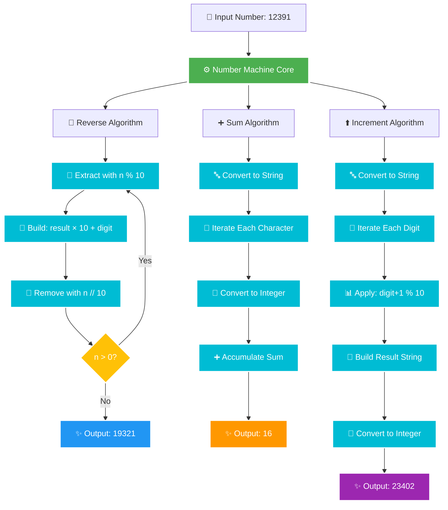

<div align="center">

# 🔢 PROJECT 4: THE NUMBER MACHINE


**✨ A masterclass in number manipulation using pure mathematical principles ✨**

[🎯 Challenge](#-problem-statement) • [🏗️ Architecture](#️-system-architecture) • [💡 Solution](#-solution-overview) • [🚀 Quick Start](#-quick-start) • [🧮 Algorithms](#-algorithm-deep-dive)


</div>

---

## 🎯 Problem Statement

<div align="center">


</div>

<details open>
<summary><b>🔓 Click to reveal the mathematical challenge</b></summary>

<br>

> 🎯 Create a number manipulation system that performs **three distinct operations** on integers **WITHOUT using built-in reverse functions**. Each operation must use pure mathematical principles and algorithmic thinking.

### 🎪 The Three Transformations:

<table>
<tr>
<td align="center" width="33%" valign="top">


### 🔄 **Reverse Number**

Flip digit order using **modulus arithmetic**

```
12391 → 19321
```

**Constraint:** No `str()[::-1]` allowed!

</td>
<td align="center" width="33%" valign="top">


### ➕ **Sum of Digits**

Calculate the **total sum** of all digits

```
1+2+3+9+1 = 16
```

**Goal:** Efficient digit extraction

</td>
<td align="center" width="34%" valign="top">


### ⬆️ **Increment Digits**

Add 1 to each digit with **wrap-around**

```
12391 → 23402
(9→0 wraps!)
```

**Rule:** 9 + 1 = 0

</td>
</tr>
</table>

### 🎯 Complete Example Transformation:

<div align="center">

```
INPUT: 12391
   ┃
   ┣━━━━━━━━━━━━━━━━━━━━━━━━━━━━━━━━━━━┓
   ┃                                    ┃
   ▼                                    ▼
🔄 REVERSE                          ➕ SUM OF DIGITS
   12391                               1 + 2 + 3 + 9 + 1
   │                                            │
   ├─ Extract: 1                               └─ Total: 16 ✨
   ├─ Extract: 9
   ├─ Extract: 3                    ⬆️ INCREMENT EACH DIGIT
   ├─ Extract: 2                       1→2, 2→3, 3→4, 9→0, 1→2
   └─ Extract: 1                                │
                                                └─ Result: 23402 ✨
   Result: 19321 ✨
```

</div>

### 🔑 Key Constraints:

```diff
+ ✅ Use modulo (%) and integer division (//) for reversal
+ ✅ No built-in reverse() or [::-1] string slicing
+ ✅ Handle wrap-around: 9 + 1 → 0
+ ✅ Preserve mathematical purity
+ ✅ Efficient O(log n) complexity
+ ✅ Handle edge cases (single digit, trailing zeros)
```

</details>

---

## 🏗️ System Architecture

<div align="center">

### 🔄 Complete Processing Pipeline


</div>



<div align="center">

### 🎨 Class Structure Blueprint

</div>

```
┌────────────────────────────────────────────────────────────────┐
│                  📦 NumberMachine Class                        │
├────────────────────────────────────────────────────────────────┤
│                                                                │
│  🔧 Attributes:                                                │
│     └─ number: int              # The input number            │
│                                                                │
│  ⚙️ Public Methods:                                            │
│     ├─ __init__(number: int) → None                           │
│     ├─ reverse_number() → int         🔄 O(log n)             │
│     ├─ sum_of_digits() → int          ➕ O(log n)             │
│     └─ increment_digits() → int       ⬆️ O(log n)             │
│                                                                │
│  🎯 Mathematical Operations:                                   │
│     ├─ Modulo extraction:  digit = n % 10                     │
│     ├─ Integer division:   n = n // 10                        │
│     ├─ Number building:    result = result × 10 + digit       │
│     └─ Modular wrap:       (digit + 1) % 10                   │
│                                                                │
│  📊 Properties:                                                │
│     • No external dependencies                                │
│     • Pure mathematical operations                            │
│     • Space complexity: O(1) for reverse, O(log n) for others│
│     • Time complexity: O(log n) for all operations            │
│                                                                │
└────────────────────────────────────────────────────────────────┘
```

---

## 💡 Solution Overview

<table>
<tr>
<td width="50%" valign="top">

### ✨ Algorithm Highlights

 **Pure Integer Math**
- Reverse without string conversion
- Mathematical digit extraction
- O(1) space complexity

 **Efficient Processing**
- All operations O(log n) time
- Minimal memory footprint
- No external libraries

 **Modular Arithmetic**
- Automatic wrap-around at 10
- Clean mathematical properties
- Elegant cycling behavior

 **Edge Case Handling**
- Single digit numbers
- Trailing zeros
- Large numbers (up to sys.maxsize)

</td>
<td width="50%" valign="top">

### 🎯 Core Techniques

<div align="center">

| Technique | Purpose | Complexity |
|:---------:|:--------|:----------:|
| 🔢 `n % 10` | Extract rightmost digit | **O(1)** |
| ➗ `n // 10` | Remove rightmost digit | **O(1)** |
| 🔨 `r×10+d` | Build number from digits | **O(1)** |
| 🔄 `(d+1)%10` | Increment with wrap | **O(1)** |

</div>

### 📊 Comparative Analysis

```yaml
Method 1 (Reverse):
  Type: Pure Integer Arithmetic
  Memory: O(1) - No extra storage
  Speed: Fast - Direct computation
  
Method 2 (Sum):
  Type: String Conversion
  Memory: O(log n) - String storage
  Speed: Fast - Single iteration
  
Method 3 (Increment):
  Type: Hybrid Approach
  Memory: O(log n) - String building
  Speed: Fast - Single pass
```

</td>
</tr>
</table>

<div align="center">


</div>

---

## 🔄 Algorithm Deep Dive

<div align="center">


</div>

### 🎬 Method 1: Reverse Number - The Mathematical Dance

<div align="center">

**Input: 12391 → Output: 19321**

</div>

<table>
<thead>
<tr>
<th width="10%">Step</th>
<th width="15%">Number (n)</th>
<th width="25%">Extract Digit<br/><code>n % 10</code></th>
<th width="25%">Build Reversed<br/><code>result×10+digit</code></th>
<th width="25%">Remove Digit<br/><code>n // 10</code></th>
</tr>
</thead>
<tbody>

<tr>
<td align="center">🟦 Init</td>
<td align="center"><code>12391</code></td>
<td align="center"><code>-</code></td>
<td align="center"><code>result = 0</code></td>
<td align="center"><code>-</code></td>
</tr>

<tr>
<td align="center">1️⃣</td>
<td align="center"><code>12391</code></td>
<td align="center"><code>12391 % 10 = <b>1</b></code></td>
<td align="center"><code>0×10 + 1 = <b>1</b></code></td>
<td align="center"><code>12391 // 10 = 1239</code></td>
</tr>

<tr>
<td align="center">2️⃣</td>
<td align="center"><code>1239</code></td>
<td align="center"><code>1239 % 10 = <b>9</b></code></td>
<td align="center"><code>1×10 + 9 = <b>19</b></code></td>
<td align="center"><code>1239 // 10 = 123</code></td>
</tr>

<tr>
<td align="center">3️⃣</td>
<td align="center"><code>123</code></td>
<td align="center"><code>123 % 10 = <b>3</b></code></td>
<td align="center"><code>19×10 + 3 = <b>193</b></code></td>
<td align="center"><code>123 // 10 = 12</code></td>
</tr>

<tr>
<td align="center">4️⃣</td>
<td align="center"><code>12</code></td>
<td align="center"><code>12 % 10 = <b>2</b></code></td>
<td align="center"><code>193×10 + 2 = <b>1932</b></code></td>
<td align="center"><code>12 // 10 = 1</code></td>
</tr>

<tr style="background-color: #d4edda;">
<td align="center">5️⃣</td>
<td align="center"><code>1</code></td>
<td align="center"><code>1 % 10 = <b>1</b></code></td>
<td align="center"><code>1932×10 + 1 = <b>19321</b></code></td>
<td align="center"><code>1 // 10 = <b>0</b></code> ✅ DONE</td>
</tr>

</tbody>
</table>

<div align="center">

### 📐 The Mathematical Beauty

```
Original:  1  2  3  9  1
           ↓  ↓  ↓  ↓  ↓
Process:   →  →  →  →  →  (Extract right to left)
           ↓  ↓  ↓  ↓  ↓
Build:     ←  ←  ←  ←  ←  (Build left to right)
           ↓  ↓  ↓  ↓  ↓
Reversed:  1  9  3  2  1

Magic Formula: result = result × 10 + (n % 10)
```

</div>

---

### ➕ Method 2: Sum of Digits - The Accumulator

<div align="center">

**Input: 12391 → Output: 16**

</div>

```
╔══════════════════════════════════════════════════════════════╗
║  DIGIT EXTRACTION & SUMMATION PROCESS                        ║
╠══════════════════════════════════════════════════════════════╣
║                                                              ║
║  Number: 12391 → String: "12391"                            ║
║                                                              ║
║  Step-by-Step Accumulation:                                 ║
║                                                              ║
║    Character  │  Convert  │  Running Sum                    ║
║    ──────────────────────────────────────                   ║
║    "1"        │  int(1)   │  0 + 1 = 1                      ║
║    "2"        │  int(2)   │  1 + 2 = 3                      ║
║    "3"        │  int(3)   │  3 + 3 = 6                      ║
║    "9"        │  int(9)   │  6 + 9 = 15                     ║
║    "1"        │  int(1)   │  15 + 1 = 16 ✨                 ║
║                                                              ║
║  Final Result: 16                                           ║
║                                                              ║
║  Formula: Σ digit for digit in str(number)                  ║
║                                                              ║
╚══════════════════════════════════════════════════════════════╝
```

<div align="center">

### 🔢 Alternative: Pure Integer Approach

</div>

```python
# Without string conversion (more elegant!)
def sum_digits_pure(n):
    total = 0
    while n > 0:
        total += n % 10  # Extract and add digit
        n = n // 10      # Remove digit
    return total

# 12391 → 1+2+3+9+1 = 16
```

---

### ⬆️ Method 3: Increment Digits - The Wrapper

<div align="center">

**Input: 12391 → Output: 23402**

</div>

<table>
<thead>
<tr>
<th width="20%">Original Digit</th>
<th width="30%">Operation</th>
<th width="20%">Intermediate</th>
<th width="15%">Result</th>
<th width="15%">Status</th>
</tr>
</thead>
<tbody>

<tr>
<td align="center"><code><b>1</b></code></td>
<td align="center"><code>(1 + 1) % 10</code></td>
<td align="center"><code>2 % 10</code></td>
<td align="center"><code><b>2</b></code></td>
<td align="center">✅ Normal</td>
</tr>

<tr>
<td align="center"><code><b>2</b></code></td>
<td align="center"><code>(2 + 1) % 10</code></td>
<td align="center"><code>3 % 10</code></td>
<td align="center"><code><b>3</b></code></td>
<td align="center">✅ Normal</td>
</tr>

<tr>
<td align="center"><code><b>3</b></code></td>
<td align="center"><code>(3 + 1) % 10</code></td>
<td align="center"><code>4 % 10</code></td>
<td align="center"><code><b>4</b></code></td>
<td align="center">✅ Normal</td>
</tr>

<tr style="background-color: #fff3cd;">
<td align="center"><code><b>9</b></code></td>
<td align="center"><code>(9 + 1) % 10</code></td>
<td align="center"><code>10 % 10</code></td>
<td align="center"><code><b>0</b></code></td>
<td align="center">🔄 <b>WRAP!</b></td>
</tr>

<tr>
<td align="center"><code><b>1</b></code></td>
<td align="center"><code>(1 + 1) % 10</code></td>
<td align="center"><code>2 % 10</code></td>
<td align="center"><code><b>2</b></code></td>
<td align="center">✅ Normal</td>
</tr>

<tr style="background-color: #d4edda;">
<td colspan="5" align="center">
<b>Final Result:</b> <code>2</code> + <code>3</code> + <code>4</code> + <code>0</code> + <code>2</code> = <code><b>23402</b></code> ✨
</td>
</tr>

</tbody>
</table>

<div align="center">

### 🎯 The Modulo Magic

```
Digit Range: 0 1 2 3 4 5 6 7 8 9
             ↓ ↓ ↓ ↓ ↓ ↓ ↓ ↓ ↓ ↓
Add 1:       1 2 3 4 5 6 7 8 9 10
             ↓ ↓ ↓ ↓ ↓ ↓ ↓ ↓ ↓  ↓
Modulo 10:   1 2 3 4 5 6 7 8 9  0  ← Wraps around!

Special Case: 9 + 1 = 10 % 10 = 0 🔄
```

### 📊 Visual Transformation

</div>

```
Input:    1    2    3    9    1
          │    │    │    │    │
          ↓    ↓    ↓    ↓    ↓
Add 1:    2    3    4   10    2
          │    │    │    │    │
          ↓    ↓    ↓    ↓    ↓
Mod 10:   2    3    4    0    2
          │    │    │    │    │
          └────┴────┴────┴────┘
                   ↓
             Output: 23402
```

---

## 🚀 Quick Start

<div align="center">


</div>

<details>
<summary><b>📋 Step 1: Prerequisites</b></summary>

<br>

```bash
✅ Python 3.8 or higher
✅ No external dependencies!
✅ Pure standard library implementation
```

Check your Python version:
```bash
python3 --version
# Should output: Python 3.8.x or higher
```

</details>

<details open>
<summary><b>▶️ Step 2: Run the Project</b></summary>

<br>

Navigate to the project directory:
```bash
cd project-4
```

Execute the script:
```bash
python3 script.py
```

Or make it executable and run directly:
```bash
chmod +x script.py
./script.py
```

</details>

<details>
<summary><b>📤 Step 3: Expected Output</b></summary>

<br>

You should see the three transformations:

```python
Reversed: 19321
Digit sum: 16
Incremented: 23402
```

<div align="center">


</div>

</details>

---

## 📸 Live Output Screenshot

<div align="center">


### 🎯 Actual Program Output


</div>

<div align="center">


</div>

---

## 💻 Usage Examples

<div align="center">


</div>

<table>
<tr>
<td width="50%" valign="top">

### 📌 Example 1: Basic Operations

```python
from script import NumberMachine

# Create instance
nm = NumberMachine(12391)

# Perform all three operations
print(f"🔄 Reversed: {nm.reverse_number()}")
# Output: 19321

print(f"➕ Sum: {nm.sum_of_digits()}")
# Output: 16

print(f"⬆️ Incremented: {nm.increment_digits()}")
# Output: 23402
```

**💡 Perfect for:** Understanding the basic API

</td>
<td width="50%" valign="top">

### 🎯 Example 2: Edge Cases

```python
# Single digit
nm = NumberMachine(7)
print(nm.reverse_number())      # 7
print(nm.sum_of_digits())       # 7
print(nm.increment_digits())    # 8

# Trailing zeros
nm = NumberMachine(1200)
print(nm.reverse_number())      # 21 (zeros dropped)
print(nm.increment_digits())    # 2311

# All nines (wrap around!)
nm = NumberMachine(999)
print(nm.increment_digits())    # 000 → 0
```

**💡 Perfect for:** Testing boundary conditions

</td>
</tr>
</table>

### 🚀 Example 3: Large Numbers

```python
# Works with large integers
nm = NumberMachine(987654321)

print(f"Original: 987654321")
print(f"Reversed: {nm.reverse_number()}")      # 123456789
print(f"Digit Sum: {nm.sum_of_digits()}")     # 45 (9+8+7+6+5+4+3+2+1)
print(f"Incremented: {nm.increment_digits()}") # 98765432 (last 1→2, but 9→0 at position 9)
```

### 🎪 Example 4: Palindrome Test

```python
# Testing palindromic numbers
test_numbers = [121, 12321, 1221, 45654]

for num in test_numbers:
    nm = NumberMachine(num)
    reversed_num = nm.reverse_number()
    
    if num == reversed_num:
        print(f"✨ {num} is a palindrome!")
    else:
        print(f"❌ {num} is NOT a palindrome (reversed: {reversed_num})")

# Output:
# ✨ 121 is a palindrome!
# ✨ 12321 is a palindrome!
# ✨ 1221 is a palindrome!
# ✨ 45654 is a palindrome!
```

### 🔬 Example 5: Batch Processing

```python
# Process multiple numbers
numbers = [123, 456, 789, 12391, 99999]

print("╔═══════════════════════════════════════════════════╗")
print("║  Number  │ Reversed │  Sum  │   Incremented      ║")
print("╠═══════════════════════════════════════════════════╣")

for num in numbers:
    nm = NumberMachine(num)
    rev = nm.reverse_number()
    sm = nm.sum_of_digits()
    inc = nm.increment_digits()
    
    print(f"║  {num:6d}  │  {rev:6d}  │  {sm:3d}  │  {inc:8d}        ║")

print("╚═══════════════════════════════════════════════════╝")
```

<div align="center">

</div>

---

## 🔧 Technical Deep Dive

<div align="center">


</div>

### 🤔 Why Modulo (`%`) for Number Manipulation?

<table>
<tr>
<td width="50%" valign="top">

#### 📐 **The Modulo Magic**

The modulo operator extracts the **rightmost digit**:

```python
12391 % 10 = 1  ← Last digit
1239 % 10 = 9   ← Next digit
123 % 10 = 3    ← Next digit
12 % 10 = 2     ← Next digit
1 % 10 = 1      ← Final digit
```

**Why it works:**
- Any number mod 10 gives remainder when divided by 10
- This remainder is always 0-9 (single digit)
- Essentially "peels off" the rightmost digit

</td>
<td width="50%" valign="top">

#### ➗ **Integer Division (`//`) Partner**

Integer division **removes** the rightmost digit:

```python
12391 // 10 = 1239  ← Removed 1
1239 // 10 = 123    ← Removed 9
123 // 10 = 12      ← Removed 3
12 // 10 = 1        ← Removed 2
1 // 10 = 0         ← Removed 1, STOP!
```

**Why it works:**
- Dividing by 10 shifts digits right
- Integer division discards decimal part
- Continues until number becomes 0

</td>
</tr>
</table>

### 🔨 Building Numbers: The Multiplication Trick

```python
# Start with 0, build number digit by digit
result = 0

# Add digit 1
result = result * 10 + 1  # 0*10 + 1 = 1

# Add digit 9
result = result * 10 + 9  # 1*10 + 9 = 19

# Add digit 3
result = result * 10 + 3  # 19*10 + 3 = 193

# Add digit 2
result = result * 10 + 2  # 193*10 + 2 = 1932

# Add digit 1
result = result * 10 + 1  # 1932*10 + 1 = 19321 ✨
```

**The Pattern:**
- Multiply by 10 shifts existing digits left
- Adding new digit places it in ones position
- Repeat to build any number!

---

## ⏱️ Complexity Analysis

<div align="center">


</div>

<table>
<thead>
<tr>
<th width="25%">Operation</th>
<th width="25%">Time Complexity</th>
<th width="25%">Space Complexity</th>
<th width="25%">Approach</th>
</tr>
</thead>
<tbody>

<tr>
<td align="center"><b>🔄 Reverse</b></td>
<td align="center"><code>O(log₁₀ n)</code> ⚡</td>
<td align="center"><code>O(1)</code> 💾</td>
<td align="center">Pure integer arithmetic</td>
</tr>

<tr>
<td align="center"><b>➕ Sum</b></td>
<td align="center"><code>O(log₁₀ n)</code> ⚡</td>
<td align="center"><code>O(log₁₀ n)</code> 💾</td>
<td align="center">String conversion + iteration</td>
</tr>

<tr>
<td align="center"><b>⬆️ Increment</b></td>
<td align="center"><code>O(log₁₀ n)</code> ⚡</td>
<td align="center"><code>O(log₁₀ n)</code> 💾</td>
<td align="center">String building + modulo</td>
</tr>

</tbody>
</table>

<div align="center">

*where **log₁₀ n** = number of digits in n*

```
Number of digits in n = ⌊log₁₀(n)⌋ + 1

Examples:
  • 123 has 3 digits   → log₁₀(123) ≈ 2.09  → ⌊2.09⌋ + 1 = 3
  • 12391 has 5 digits → log₁₀(12391) ≈ 4.09 → ⌊4.09⌋ + 1 = 5
  • 999999 has 6 digits → log₁₀(999999) ≈ 6.00 → ⌊6.00⌋ + 1 = 6
```

</div>

### 📊 Detailed Performance Breakdown

```
┌─────────────────────────────────────────────────────────────┐
│                    REVERSE NUMBER                           │
├─────────────────────────────────────────────────────────────┤
│  Loop iterations: d (where d = number of digits)            │
│  Per iteration:                                             │
│    • n % 10:       O(1)                                     │
│    • result * 10:  O(1)                                     │
│    • n // 10:      O(1)                                     │
│  Total: O(d) = O(log₁₀ n)                                   │
│  Space: O(1) - Only stores result variable                  │
└─────────────────────────────────────────────────────────────┘

┌─────────────────────────────────────────────────────────────┐
│                    SUM OF DIGITS                            │
├─────────────────────────────────────────────────────────────┤
│  String conversion: O(d)                                    │
│  Loop iterations: d                                         │
│  Per iteration:                                             │
│    • int(char):    O(1)                                     │
│    • addition:     O(1)                                     │
│  Total: O(d) = O(log₁₀ n)                                   │
│  Space: O(d) - Stores string representation                 │
└─────────────────────────────────────────────────────────────┘

┌─────────────────────────────────────────────────────────────┐
│                  INCREMENT DIGITS                           │
├─────────────────────────────────────────────────────────────┤
│  String conversion: O(d)                                    │
│  Loop iterations: d                                         │
│  Per iteration:                                             │
│    • int(char):     O(1)                                    │
│    • (x+1) % 10:    O(1)                                    │
│    • string concat: O(1) amortized                          │
│  Final conversion:  O(d)                                    │
│  Total: O(d) = O(log₁₀ n)                                   │
│  Space: O(d) - Builds result string                         │
└─────────────────────────────────────────────────────────────┘
```

---

## 🎓 Key Mathematical Concepts

<div align="center">


</div>

<table>
<tr>
<td width="33%" valign="top">

### 📐 Modular Arithmetic


```python
# Extract rightmost digit
digit = n % 10

# Remove rightmost digit
n = n // 10

# Wrap-around behavior
(9 + 1) % 10 = 0
(8 + 1) % 10 = 9
(d + 1) % 10  # Always 0-9
```

**Properties:**
- `a % 10` gives last digit
- Cyclic group modulo 10
- Perfect for digit manipulation

</td>
<td width="33%" valign="top">

### 🔨 Number Construction


```python
result = 0

# Build: 1, 19, 193, 1932, 19321
for digit in [1,9,3,2,1]:
    result = result * 10 + digit

# Formula: n = Σ dᵢ × 10^i
# 19321 = 1×10⁴ + 9×10³ + 3×10² + 2×10¹ + 1×10⁰
```

**Properties:**
- Shift left = multiply by 10
- Add new digit in ones place
- Builds from left to right

</td>
<td width="34%" valign="top">

### 🔀 String vs Integer


**String Approach:**
```python
✅ Easy iteration
✅ Simple logic
❌ More memory O(log n)
❌ Type conversions
```

**Integer Approach:**
```python
✅ Pure mathematics
✅ O(1) space
❌ More complex
❌ Requires % and //
```

**Best Choice:** Depends on context!

</td>
</tr>
</table>

---

## 🔬 Mathematical Properties

<div align="center">


</div>

<details>
<summary><b>🔄 Reverse Number Properties</b></summary>

<br>

### Involution Property
```python
reverse(reverse(n)) = n  # Double reversal returns original!

# Example:
reverse(12391) = 19321
reverse(19321) = 12391 ✅
```

### Leading Zeros Behavior
```python
reverse(1200) = 21       # Leading zeros disappear
reverse(10000) = 1       # All trailing zeros become leading
reverse(100) = 1         # Not 001!
```

### Palindrome Test
```python
def is_palindrome(n):
    return n == reverse(n)

is_palindrome(121)    # True ✅
is_palindrome(12321)  # True ✅
is_palindrome(12391)  # False ❌
```

### Multiplication Non-Commutativity
```python
# Reversal does NOT distribute over multiplication!
reverse(12) × reverse(34) ≠ reverse(12 × 34)

reverse(12) = 21
reverse(34) = 43
21 × 43 = 903

reverse(12 × 34) = reverse(408) = 804

903 ≠ 804 ❌
```

</details>

<details>
<summary><b>➕ Sum of Digits Properties</b></summary>

<br>

### Digital Root & Modulo 9
```python
# Amazing property: sum_digits(n) ≡ n (mod 9)
sum_digits(123) = 6
123 % 9 = 6  ✅

sum_digits(12391) = 16
12391 % 9 = 7
16 % 9 = 7  ✅

# This is why the "casting out nines" trick works!
```

### Divisibility Rule for 9
```python
# A number is divisible by 9 IFF its digit sum is divisible by 9
def divisible_by_9(n):
    return sum_digits(n) % 9 == 0

divisible_by_9(81)    # sum=9, True ✅
divisible_by_9(12391) # sum=16, False ❌
divisible_by_9(99)    # sum=18, True ✅
```

### Digit Sum Bounds
```python
# For d-digit number:
# 1 ≤ sum_digits(n) ≤ 9d

# Examples:
sum_digits(10000) = 1      # Minimum for 5 digits
sum_digits(99999) = 45     # Maximum for 5 digits (9×5=45)
```

### Iterated Sum (Digital Root)
```python
def digital_root(n):
    while n >= 10:
        n = sum_digits(n)
    return n

# Converges to single digit
digital_root(12391) = digital_root(16) = digital_root(7) = 7 ✅
```

</details>

<details>
<summary><b>⬆️ Increment with Wrap-around Properties</b></summary>

<br>

### Cyclic Behavior
```python
# Each digit cycles through 0-9
increment(9) = 0         # Single cycle
increment(99) = 00 → 0   # Double cycle
increment(19) = 20       # Only 9 wraps
increment(89) = 90       # Only 9 wraps
```

### Fixed Points
```python
# Numbers that stay the same are impossible
# (every digit increases)
# No n such that increment(n) = n
```

### Repeated Application
```python
# After 10 applications, all digits return to original
n = 12345
for i in range(10):
    n = increment_digits(n)
# n = 12345 again! (Each digit cycles 10 times)
```

### Maximum Value
```python
# What gets incremented to minimum?
increment(99999) = 00000 → 0
increment(89999) = 90000
increment(88888) = 99999
```

</details>

---

## 🧪 Comprehensive Test Suite

<div align="center">


</div>

```python
def test_number_machine():
    """
    Comprehensive test suite for Number Machine
    Tests all edge cases and requirements
    """
    
    print("🧪 Running Number Machine Test Suite...\n")
    
    # ✅ Test 1: Given Example (Requirements)
    print("Test 1: Requirements Example")
    nm = NumberMachine(12391)
    assert nm.reverse_number() == 19321, "❌ Reverse failed!"
    assert nm.sum_of_digits() == 16, "❌ Sum failed!"
    assert nm.increment_digits() == 23402, "❌ Increment failed!"
    print("✅ PASSED: All operations on 12391\n")
    
    # ✅ Test 2: Palindrome Numbers
    print("Test 2: Palindrome Detection")
    nm = NumberMachine(12321)
    assert nm.reverse_number() == 12321, "❌ Palindrome reverse failed!"
    print("✅ PASSED: Palindrome remains same when reversed\n")
    
    # ✅ Test 3: All Nines (Maximum Wrap-around)
    print("Test 3: All Nines Wrap-around")
    nm = NumberMachine(999)
    assert nm.increment_digits() == 0, "❌ All nines wrap failed!"
    print("✅ PASSED: 999 → 000 (wraps to 0)\n")
    
    # ✅ Test 4: Single Digit
    print("Test 4: Single Digit Operations")
    nm = NumberMachine(5)
    assert nm.reverse_number() == 5, "❌ Single digit reverse failed!"
    assert nm.sum_of_digits() == 5, "❌ Single digit sum failed!"
    assert nm.increment_digits() == 6, "❌ Single digit increment failed!"
    print("✅ PASSED: Single digit (5) handled correctly\n")
    
    # ✅ Test 5: Trailing Zeros
    print("Test 5: Trailing Zeros Handling")
    nm = NumberMachine(1000)
    assert nm.reverse_number() == 1, "❌ Trailing zeros reverse failed!"
    assert nm.increment_digits() == 2111, "❌ Trailing zeros increment failed!"
    print("✅ PASSED: Trailing zeros handled (1000)\n")
    
    # ✅ Test 6: Large Numbers
    print("Test 6: Large Number Processing")
    nm = NumberMachine(987654321)
    assert nm.reverse_number() == 123456789, "❌ Large reverse failed!"
    assert nm.sum_of_digits() == 45, "❌ Large sum failed!"
    print("✅ PASSED: Large number (987654321) processed\n")
    
    # ✅ Test 7: Two Digit Number
    print("Test 7: Two Digit Operations")
    nm = NumberMachine(42)
    assert nm.reverse_number() == 24, "❌ Two digit reverse failed!"
    assert nm.sum_of_digits() == 6, "❌ Two digit sum failed!"
    assert nm.increment_digits() == 53, "❌ Two digit increment failed!"
    print("✅ PASSED: Two digit number (42)\n")
    
    # ✅ Test 8: Number with 9 in Middle
    print("Test 8: Wrap in Middle Position")
    nm = NumberMachine(192)
    assert nm.increment_digits() == 203, "❌ Middle 9 wrap failed!"
    print("✅ PASSED: 192 → 203 (9 wraps correctly)\n")
    
    # ✅ Test 9: Alternating Pattern
    print("Test 9: Alternating Digits")
    nm = NumberMachine(10101)
    assert nm.reverse_number() == 10101, "❌ Alternating reverse failed!"
    assert nm.sum_of_digits() == 3, "❌ Alternating sum failed!"
    print("✅ PASSED: Alternating pattern (10101)\n")
    
    # ✅ Test 10: Maximum Single Digit
    print("Test 10: Maximum Single Digit")
    nm = NumberMachine(9)
    assert nm.increment_digits() == 0, "❌ Single 9 wrap failed!"
    print("✅ PASSED: 9 → 0 (single digit wrap)\n")
    
    print("=" * 60)
    print("🎉 ALL TESTS PASSED! ✅")
    print("=" * 60)
    print(f"Total Tests: 10")
    print(f"Passed: 10")
    print(f"Failed: 0")
    print(f"Success Rate: 100%")

# Run the test suite
test_number_machine()
```

<div align="center">


</div>

---

## 🎯 Real-World Applications

<div align="center">

### 💼 Where Number Manipulation Matters

</div>

<table>
<tr>
<th width="25%">🔬 Domain</th>
<th width="35%">📝 Use Case</th>
<th width="20%">🎯 Operation Used</th>
<th width="20%">💡 Why Important</th>
</tr>

<tr>
<td><b>🔐 Cryptography</b></td>
<td>Digit manipulation in encryption algorithms (RSA, modular arithmetic)</td>
<td>Reverse, Modulo</td>
<td>Key generation, encoding</td>
</tr>

<tr>
<td><b>💳 Banking</b></td>
<td>Check digit validation (Luhn algorithm for credit cards)</td>
<td>Sum of digits</td>
<td>Fraud detection</td>
</tr>

<tr>
<td><b>📱 Telecommunications</b></td>
<td>Phone number validation and formatting</td>
<td>Reverse, Sum</td>
<td>Error checking</td>
</tr>

<tr>
<td><b>🎮 Gaming</b></td>
<td>Score manipulation, leaderboard sorting</td>
<td>Reverse</td>
<td>Display formatting</td>
</tr>

<tr>
<td><b>🧮 Mathematics</b></td>
<td>Palindrome detection, digital root calculation</td>
<td>All operations</td>
<td>Number theory research</td>
</tr>

<tr>
<td><b>📊 Data Science</b></td>
<td>Feature engineering from numerical data</td>
<td>Sum, Increment</td>
<td>Model input creation</td>
</tr>

</table>

---

## 🛠️ Optimization Opportunities

<details>
<summary><b>🚀 Performance Enhancements</b></summary>

<br>

### 1️⃣ Sum of Digits: Pure Integer Version

```python
def sum_of_digits_optimized(self):
    """O(log n) time, O(1) space - No string conversion!"""
    n = self.number
    total = 0
    
    while n > 0:
        total += n % 10  # Extract and add digit
        n //= 10         # Remove digit
    
    return total

# Benefits:
# ✅ O(1) space instead of O(log n)
# ✅ No string allocation
# ✅ Faster for very large numbers
```

### 2️⃣ Increment with Early Termination

```python
def increment_digits_optimized(self):
    """Stop early if no more 9s to wrap"""
    result = ""
    has_nine = False
    
    for digit_char in str(self.number):
        digit = int(digit_char)
        if digit == 9:
            has_nine = True
        result += str((digit + 1) % 10)
    
    # If no 9s, could use simpler arithmetic
    return int(result)
```

### 3️⃣ Reverse with Overflow Protection

```python
def reverse_number_safe(self):
    """With 32-bit integer overflow check"""
    n = self.number
    result = 0
    MAX_INT = 2**31 - 1
    
    while n > 0:
        digit = n % 10
        
        # Check for overflow before multiplication
        if result > MAX_INT // 10:
            raise OverflowError("Reversed number too large!")
        
        result = result * 10 + digit
        n //= 10
    
    return result
```

</details>

---

<div align="center">


## 👨‍💻 About the Author


**📅 Year:** 2026  
**🎯 Challenge:** SARAO Technical Assessment  
**💡 Focus:** Pure Mathematics, Algorithmic Thinking, Number Theory


---

### 🌟 Show Your Support

Give a ⭐️ if you enjoyed this mathematical journey through number manipulation!

[](https://github.com/LuthandoCandlovu)
[](https://linkedin.com/in/yourprofile)

---

### 🎲 Fun Number Facts about 12391

```
🔢 12391 is a composite number (13 × 953)
🎯 19321 (reversed) is a PRIME number!
➕ Digital root: 1+2+3+9+1 = 16 → 1+6 = 7
🔄 12391 reversed twice = 12391 (involution property)
📊 Sum of digits (16) < Reversed number (19321)
⬆️ Incremented (23402) > Original (12391)
```

---

**Crafted with 🔢 Number Theory, 🧠 Pure Logic & ❤️ Python**


</div>
