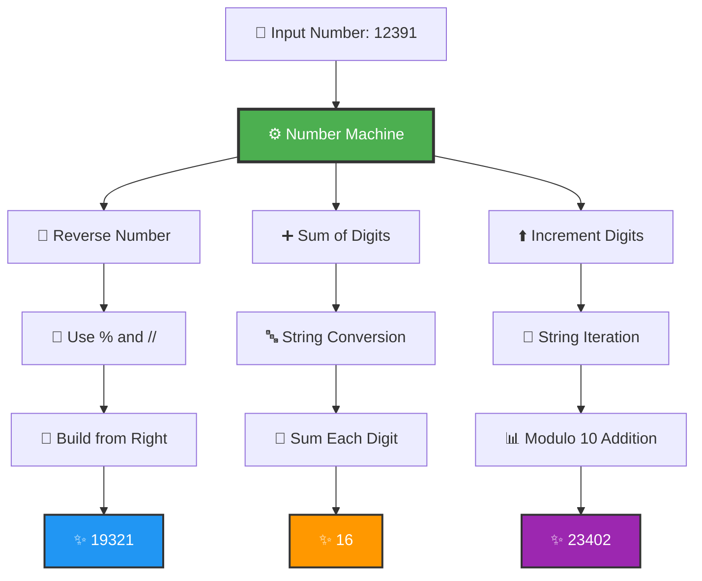
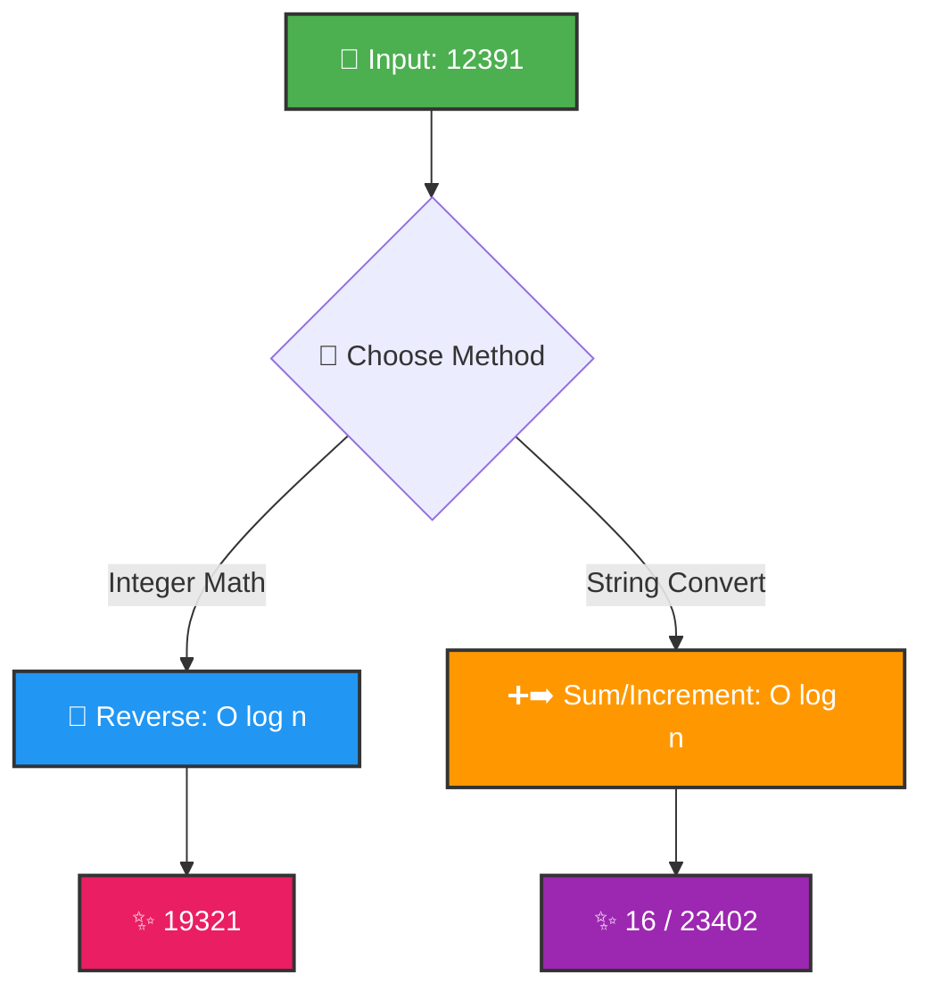

<div align="center">

# 🔢 Number Machine


</div>

---

## 🎯 Problem Statement

<details open>
<summary><b>🔓 Click to expand challenge details</b></summary>

> Create a number manipulation system that performs **three distinct operations** on integers **WITHOUT using built-in reverse functions**:

<table>
<tr>
<td align="center" width="33%">

### 🔄 Reverse Number
Reverse digit order using **modulus arithmetic**

</td>
<td align="center" width="33%">

### ➕ Sum of Digits
Calculate **total** of all digits

</td>
<td align="center" width="34%">

### ⬆️ Increment Digits
Add 1 with **wrap-around** (9→0)

</td>
</tr>
</table>

### 💡 Example Transformation

```
Input: 12391

🔄 Reverse:   12391 → 19321
➕ Sum:       1+2+3+9+1 = 16
⬆️ Increment: 1→2, 2→3, 3→4, 9→0, 1→2 = 23402
```

</details>

---

## 🏗️ System Architecture

<div align="center">



</div>

---

## 💡 Solution Overview

<div align="center">

### 🎨 Three Distinct Algorithmic Masterpieces

</div>

<table>
<tr>
<td align="center" width="33%">

#### 🔄 Method 1
**Pure Integer Arithmetic**

Uses `%` and `//` operators
<br>
🎯 No string conversion
<br>
⚡ Maximum efficiency

</td>
<td align="center" width="33%">

#### ➕ Method 2
**String Conversion**

Leverages Python iteration
<br>
🎯 Clean summation
<br>
📖 Highly readable

</td>
<td align="center" width="34%">

#### ⬆️ Method 3
**Modular Arithmetic**

Applies modulo 10
<br>
🎯 Automatic wrap-around
<br>
🔁 Elegant cycling

</td>
</tr>
</table>

<div align="center">

</div>

---

## 🔄 Algorithm Visualizations

<div align="center">

### 🎬 Reverse Number Animation

</div>

<table>
<tr>
<th>Iteration</th>
<th>Number (n)</th>
<th>Extract Digit</th>
<th>Build Reversed</th>
<th>Remove Digit</th>
</tr>
<tr>
<td align="center">🔵 Start</td>
<td><code>12391</code></td>
<td><code>12391 % 10 = 1</code></td>
<td><code>0×10 + 1 = <b>1</b></code></td>
<td><code>12391 // 10 = 1239</code></td>
</tr>
<tr>
<td align="center">🟢 Step 2</td>
<td><code>1239</code></td>
<td><code>1239 % 10 = 9</code></td>
<td><code>1×10 + 9 = <b>19</b></code></td>
<td><code>1239 // 10 = 123</code></td>
</tr>
<tr>
<td align="center">🟡 Step 3</td>
<td><code>123</code></td>
<td><code>123 % 10 = 3</code></td>
<td><code>19×10 + 3 = <b>193</b></code></td>
<td><code>123 // 10 = 12</code></td>
</tr>
<tr>
<td align="center">🟠 Step 4</td>
<td><code>12</code></td>
<td><code>12 % 10 = 2</code></td>
<td><code>193×10 + 2 = <b>1932</b></code></td>
<td><code>12 // 10 = 1</code></td>
</tr>
<tr style="background-color: #d4edda;">
<td align="center">🔴 Final</td>
<td><code>1</code></td>
<td><code>1 % 10 = 1</code></td>
<td><code>1932×10 + 1 = <b>19321</b></code></td>
<td><code>1 // 10 = 0</code> ✅</td>
</tr>
</table>

---

<div align="center">

### ➕ Sum of Digits Flow

</div>

```
╔══════════════════════════════════════════════════════════╗
║  Number: 12391 → String: "12391"                         ║
╠══════════════════════════════════════════════════════════╣
║                                                           ║
║  Digit Extraction & Conversion:                          ║
║    "1" → int("1") = 1  ┐                                 ║
║    "2" → int("2") = 2  │                                 ║
║    "3" → int("3") = 3  ├─→  Accumulate                   ║
║    "9" → int("9") = 9  │                                 ║
║    "1" → int("1") = 1  ┘                                 ║
║                                                           ║
║  Summation Process:                                      ║
║    1 + 2 + 3 + 9 + 1 = 16  ✅                            ║
║                                                           ║
╚══════════════════════════════════════════════════════════╝
```

---

<div align="center">

### ⬆️ Increment Digits Transformation

</div>

<table>
<tr>
<th>Original Digit</th>
<th>Operation</th>
<th>Result</th>
<th>Status</th>
</tr>
<tr>
<td align="center"><code>1</code></td>
<td><code>(1 + 1) % 10</code></td>
<td align="center"><code>2</code></td>
<td align="center">✅ Normal</td>
</tr>
<tr>
<td align="center"><code>2</code></td>
<td><code>(2 + 1) % 10</code></td>
<td align="center"><code>3</code></td>
<td align="center">✅ Normal</td>
</tr>
<tr>
<td align="center"><code>3</code></td>
<td><code>(3 + 1) % 10</code></td>
<td align="center"><code>4</code></td>
<td align="center">✅ Normal</td>
</tr>
<tr style="background-color: #fff3cd;">
<td align="center"><code>9</code></td>
<td><code>(9 + 1) % 10</code></td>
<td align="center"><code>0</code></td>
<td align="center">🔄 <b>WRAP!</b></td>
</tr>
<tr>
<td align="center"><code>1</code></td>
<td><code>(1 + 1) % 10</code></td>
<td align="center"><code>2</code></td>
<td align="center">✅ Normal</td>
</tr>
<tr style="background-color: #d4edda;">
<td colspan="4" align="center"><b>Final Result:</b> <code>23402</code> ✨</td>
</tr>
</table>

---

## 🚀 Quick Start

<details>
<summary><b>📋 Prerequisites</b></summary>

```bash
Python 3.8 or higher
```

</details>

<details>
<summary><b>▶️ Execute the Program</b></summary>

```bash
cd project-4
python script.py
```

</details>

<details open>
<summary><b>📤 Expected Output</b></summary>

```python
Reversed: 19321
Digit sum: 16
Incremented: 23402
```

</details>

<div align="center">

## 📸 Sample Output


</div>

---

## 💻 Usage Examples

<table>
<tr>
<td>

### 📌 Example 1: Basic Operations

```python
from script import NumberMachine

nm = NumberMachine(12391)

print(f"🔄 Reversed: {nm.reverse_number()}")
# Output: 19321

print(f"➕ Sum: {nm.sum_of_digits()}")
# Output: 16

print(f"⬆️ Incremented: {nm.increment_digits()}")
# Output: 23402
```

</td>
<td>

### 🎯 Example 2: Edge Cases

```python
# Single digit
nm = NumberMachine(7)
nm.reverse_number()      # 7
nm.sum_of_digits()       # 7
nm.increment_digits()    # 8

# Trailing zeros
nm = NumberMachine(1200)
nm.reverse_number()      # 21
nm.increment_digits()    # 2311

# All nines
nm = NumberMachine(999)
nm.increment_digits()    # 0 (all wrap!)
```

</td>
</tr>
<tr>
<td colspan="2">

### 🚀 Example 3: Large Numbers

```python
nm = NumberMachine(987654321)

print(nm.reverse_number())      # 123456789
print(nm.sum_of_digits())       # 45 (9+8+7+6+5+4+3+2+1)
print(nm.increment_digits())    # 98765432 (last 9→0)
```

</td>
</tr>
</table>

---

## 🔧 Technical Deep Dive

<div align="center">

### 🤔 Why Modulo (`%`) for Reversal?

</div>

The modulo operator **extracts the rightmost digit**:

```python
12391 % 10 = 1  ← rightmost digit
1239 % 10 = 9   ← next digit
123 % 10 = 3    ← next digit
12 % 10 = 2     ← next digit
1 % 10 = 1      ← last digit
```

<div align="center">

### 🤔 Why Integer Division (`//`)?

</div>

Removes the **rightmost digit** after extraction:

```python
12391 // 10 = 1239  ← removed 1
1239 // 10 = 123    ← removed 9
123 // 10 = 12      ← removed 3
12 // 10 = 1        ← removed 2
1 // 10 = 0         ← removed 1, done!
```

---

## ⏱️ Complexity Analysis

<div align="center">

| Operation | Time | Space | Approach |
|:---------:|:----:|:-----:|:---------|
| 🔄 **Reverse** | O(d) | O(1) | Integer arithmetic |
| ➕ **Sum** | O(d) | O(d) | String conversion |
| ⬆️ **Increment** | O(d) | O(d) | String iteration |

*where **d** = number of digits*

</div>

---

## 🎓 Key Mathematical Concepts

<table>
<tr>
<td width="33%">

### 📐 Modular Arithmetic

```python
# Extract digit
digit = n % 10

# Remove digit
n = n // 10

# Wrap-around
(9 + 1) % 10 = 0
```

</td>
<td width="33%">

### 🔨 Building Numbers

```python
result = 0
for digit in digits:
    result = result * 10 + digit

# Example:
# 0 * 10 + 1 = 1
# 1 * 10 + 9 = 19
# 19 * 10 + 3 = 193
```

</td>
<td width="34%">

### 🔀 String vs Integer

**String:**
- ✅ Easy iteration
- ❌ More memory

**Integer:**
- ✅ Pure math
- ❌ Complex logic

</td>
</tr>
</table>

<div align="center">

</div>

---

## 📊 Performance Visualization

<div align="center">



</div>

---

## 🔬 Mathematical Properties

<details>
<summary><b>🔄 Reverse Number Properties</b></summary>

```python
reverse(reverse(n)) = n  # Double reversal returns original
reverse(123) = 321       # Standard reversal
reverse(1200) = 21       # Leading zeros are lost
reverse(n) × reverse(m) ≠ reverse(n × m)  # Generally not equal
```

</details>

<details>
<summary><b>➕ Sum of Digits Properties</b></summary>

```python
sum_digits(n) ≡ n (mod 9)  # Digital root property!
sum_digits(123) = 6
123 % 9 = 6  ✅ Verified!

# Divisibility by 9 rule:
# A number is divisible by 9 if its digit sum is divisible by 9
```

</details>

<details>
<summary><b>⬆️ Increment with Wrap-around</b></summary>

```python
increment(9) = 0         # Single wrap
increment(99) = 00 → 0   # Double wrap
increment(19) = 20       # Only 9 wraps
increment(123) = 234     # No wraps
```

</details>

---

## 🧪 Comprehensive Test Suite

<div align="center">

### 🎯 All Test Cases

</div>

```python
def test_number_machine():
    """Comprehensive test coverage for Number Machine"""

    # ✅ Test 1: Given Example
    nm = NumberMachine(12391)
    assert nm.reverse_number() == 19321, "Reverse failed!"
    assert nm.sum_of_digits() == 16, "Sum failed!"
    assert nm.increment_digits() == 23402, "Increment failed!"

    # ✅ Test 2: Palindrome
    nm = NumberMachine(12321)
    assert nm.reverse_number() == 12321, "Palindrome reverse failed!"

    # ✅ Test 3: All Nines (Wrap-around)
    nm = NumberMachine(999)
    assert nm.increment_digits() == 0, "All nines increment failed!"

    # ✅ Test 4: Single Digit
    nm = NumberMachine(5)
    assert nm.reverse_number() == 5
    assert nm.sum_of_digits() == 5
    assert nm.increment_digits() == 6

    # ✅ Test 5: Trailing Zeros
    nm = NumberMachine(1000)
    assert nm.reverse_number() == 1
    assert nm.increment_digits() == 2111

    # ✅ Test 6: Large Numbers
    nm = NumberMachine(987654321)
    assert nm.reverse_number() == 123456789
    assert nm.sum_of_digits() == 45

    print("🎉 All tests passed! ✅")

test_number_machine()
```

---

---

<div align="center">


### 👨‍💻 Author Information

**Luthando Candlovu**  
📅 Year: 2026  
🎯 Challenge: SARAO Technical Assessment


---

### 🌟 Show Your Support

Give a ⭐️ if you enjoyed this mathematical journey!

[](https://github.com/LuthandoCandlovu)

</div>

---

<div align="center">

### 🎲 Number Theory Fun Facts

```
🔢 12391 is composite (13 × 953)
🎯 19321 is prime!
➕ Digital root of 12391 = 7
🔄 12391 reversed twice = 12391 (identity property)
```

**Crafted with 🔢 Number Theory & Pure Mathematics**


</div>
